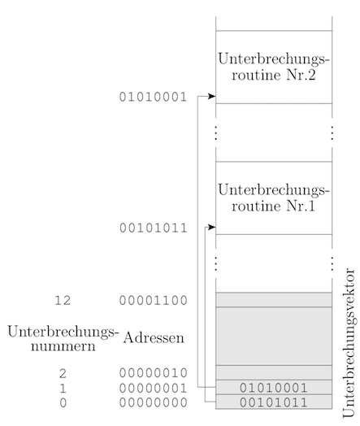

# Kurseinheit 1

## 1.1 Was ist ein Betriebssystem

Ein Betriebssystem ist eine Menge von Programmen, die es ermöglichen, den Rechner zu betreiben und Anwendungsprogramme auf ihm auszuführen. Es schliesst die semantische Lücke zwischen Hardware und Applikation, indem von der Komplexität der Hardware abstrahiert wird.

## 1.1.1 Welche Aufgaben hat ein Betriebssystem

* **Gerätesteuerung**: Hardwareunabhängigkeit, Dienste sollen möglichst im Betriebssystem lokalisiert/gesteuert werden. (Betriebssystem als *control program*)
* **Schutz**: Vorhandenen Speicher verwalten und die Daten einzelner Benutzer vor unbefugten Zugriffen schützen.
* Entdeckung/ Behandlung von **Fehlern**: Bei jedem Fehler muss das Betriebssystem geeignet reagieren. z.B.
    * Division durch 0
    * Benutzung illegaler Adressen bei der Ausführung von Applikationen
    * Defekte in Leitungen, Datenträgern oder Laufwerken
    * Papierstau im Drucker
* **Mehrprogrammbetrieb**: Rechner gleichzeitig von mehreren Benutzern benutzt werden. Jeder Benutzer lässt eigene Applikationen ausführen
* Unterschiedliche **Betriebsarten**: Wie arbeitet das Betriebssystem Aufträge ab? (Dialog-, Stapel- und Echtzeitbetrieb)
* **Prozess-Synchronisation und -Kommunikation**: zusammengehörige, parallele Prozesse müssen Nachrichten austauschen und sich bei der Benutzung gemeinsamer Daten oder anderer Ressourcen synchronisieren können
* **Ressourcenverwaltung**: Das Betriebssystem muss Ressourcen verwalten und bei konkurrierenden Anforderungen entscheiden, wie und in welcher Reihenfolge die Anforderungen bedient werden sollen. Hierbei ist anzustreben, alle Anforderungen möglichst rasch, vollständig und fair zu erfüllen, die vorhandenen Ressourcen voll auszunutzen und zugleich den Verwaltungsaufwand zu minimieren
    * CPU
    * E/A-Geräte (Bildschirm, Tastatur, Maus, Laufwerke)
    * Hauptspeicher (inkl. der darauf gespeicherten Programme/Daten)
    * Kommunikationsverbindungen
* **Kommandosprache**: Der Benutzer kann hierüber mit dem System kommunizieren (z.B. Rechner beauftragen, ein Programm auszuführen o. abzubrechen). Häufige Befehlsfolgen werden in *Kommandoprozedur* gespeichert.
* **Administration**: "Applikationen" des Betriebssystems z.B.
    * Datensicherung
    * Systemgenerierung
    * Systemkonfigurierung
    * Leistungsüberwachung
    * sonstige Administrationsaufgaben
    * einfache Textverarbeitung
    * Modulverwaltung
    * Formatierung

Die Festlegung von Art und Umfang dieser Funktionen wird vom intendierten Anwendungsbereich und Annahmen über die Leistungsfähigkeit der unterliegenden Hardware und deren Kosten abhängen.

> ***Merksatz:*** **G**ustav **S**ucht **F**eine **M**uscheln **B**ei **P**uerto **R**ico (**K**aribischer **A**rchipel)

### 1.1.2 Wo liegt das Betriebssystem in einem Schichtenmodell im Computersystem? Welche Schnittstellen bietet das Betriebssystem an

| Schichtenmodell               |
|:-----------------------------:|
| höhere Programmiersprachen    |
| Assemblersprachen             |
| ***Betriebssystemebene***     |
| konventionelle Maschinenebene |
| Mikroprogrammebene            |
| digitale Logikebene           |

Das Betriebssystem bietet

* hardwareabhängige (insb. Gerätetreiber)
* hardwareunabhängige (Systemaufrufe für Dateien, Konsole, E/A-Geräte etc.)

Schnittstellen an.

### 1.1.3 Wie (Mit welchen Strategien und welchen Mechanismen) werden die einzelnen Aufgaben realisiert

(Nicht alle Frage kann man schon jetzt beantworten, aber am Ende des Kurses.)

## 1.2 Können Sie das Ebenenmodell (Schichtenmodell) für Rechner aus Kurseinheit 1 beschreiben

Rechner besteht aus einer Hierarchie von virtuellen Maschinen. Jede virtuelle Maschine bietet Ihrer überliegenden Schicht Dienste an und nimmt Dienste der unteren Schicht in Anspruch.

### 1.2.1 Welche Vorteile hat ein Ebenenmodell

Das Ebenenmodell abstrahiert schrittweise von kompexer Hardware zur immer einfacheren Beherrschbarkeit für den Applikationsentwickler.

### 1.2.2 Was ist das Prinzip eines Ebenenmodells

Jede Ebene kann ausgetauscht werden, solange die Schnittstellen weiterhin die vorgesehene Funktion erfüllen.

### 1.2.3 Welche Aufgaben haben die einzelnen Schichten

* **Digitale Logikebene(Hardware)**: Rechner als Menge von logischen Gattern, die boolsche Funktionen realisieren.
* **Mikroprogramm-Ebene(Firmware)**: Elementare Funktionen der Logikgatter werden über Mikrobefehle gesteuert (Kopie des Inhalts eines Registers in ein anderes)
* **Konventionelle Maschinenebene**: Jeder Maschinenbefehl eines Prozessors wird durch ein Mikroprogramm realisiert. Diese Ebene ist die tiefste Ebene, die Programmierer im Normalfall erreichen.
* **Betriebssystemebene**: erweitert konventionelle Maschinenebene um system-calls(**API**):
    * Operationen mit Dateien
    * Operationen mit Prozessen (erzeugen, überwachen, steuern, beenden, etc.)
    * Operationen zur Hauptspeicherverwaltung
    * E/A-Operationen
    * Setzen/Abfragen von Systemparametern
    * allg. Zustandsabfragen (Systemuhr, aktive Prozesse...)
* **Assemblerebene**: Maschinenprogramme werden in einer für Menschen besser lesbaren Form dargestellt.
* **Höhere Programmiersprachen**: Unabhängig von konkreten Prozessoren und Betriebssytemen, der Compiler ist das Bindeglied zwischen Quellcode und CPU/OS. Spezifisch sind Funktionen wie
    * E/A werden meist in Bibliotheken realisiert, so dass eine Portierung auf eine andere Plattform nur eine geringe Hürde ist.
    * Parallelität: Müssen durch Laufzeitsystem der Sprache oder OS unterstützt werden. Im OS ist es meist unpraktikabel, da der Aufwand zum erzeugen/synchronisieren (neuer Adressraum etc.) von Prozessen sehr hoch(**schwergewichtig**).
    * Trend geht zu *leichtgewichtigen* Prozessen (Threads)

## 1.3 Wie kann ein Betriebssystem die Kontrolle über das System behalten

Das Betriebssysteme erhält die Kontrolle vom System durch Unterbrechungen, welche durch Anwendungen oder E/A-Geräte ausgelöst werden.

### 1.3.1 Ein Betriebssystem funktioniert dank des Unterbrechungsmechanismus. Welche Zwecke hat die Unterbrechung

Eine Unterbrechung pausiert die Ausführung des aktuell laufenden Prozesses um einen privilegierten Befehl auszuführen.

### 1.3.2 Welche Aufgaben des Betriebssystems können durch Unterbrechungen gelöst werden

Alle Aufgaben, welche in einer Unterbrechungsroutine beschrieben werden können, z.B.:

* Kommunikation mit E/A-Geräten
* Realisierung von Systemaufrufen
* Realisierung von Zeitscheiben (*Zeitgeber benötigt*)
* Behandlung von Programmfehlern

### 1.3.3 Welche Unterbrechungen gibt es? Wodurch werden sie ausgelöst

* **Traps:** Werden durch den geraden laufenden Prozess verursacht, befinden sich also auch in einem zeitlichen Zusammenhang (**synchron**) mit dem Prozess. Beispiele für Traps:
    - Division durch 0
    - Überlauf bei einer arithmetischen Operation - Unbekannter Befehl
    - Ein Fehler bei einem Speicherzugriff
    - Systemaufruf

* **Interrupts:** Externe (**asynchrone**) Unterbrechungen. Sie sind Änderung in der Ablaufsteuerung, die nicht vom laufenden Prozess, sondern von etwas anderem (meist E/A-Geräten) verursacht werden. Beispiele für Interrupts:
    - Timer
    - Eine Taste gedrückt
    - E/A-Signale
    - Seitenfehler

### 1.3.4 Gibt es Unterschiede bei der Behandlung von Unterbrechungen

Die Unterschiede sind in der Tabelle

| Trap           | Interrupt            |
|----------------|----------------------|
| synchron       | asynchron            |
| vorhersagbar   | unvorhersagbar       |
| reproduzierbar | nicht reproduzierbar |

## 1.4 Beschreiben Sie die Unterbrechung, die durch z.B. ein Ein-/Ausgabegerät ausgelöst wurde

Die Antwort soll die Antworten auf folgende Fragen beinhalten:

### 1.4.1 Warum löst ein Ein-/Ausgabegerät eine Unterbrechung aus

E/A-Operationen haben eine unbestimmte Laufzeit. Damit die CPU nicht *warten* muss, bis eine Operation beendet ist, macht sie andere anstehende Aufgaben. Das E/A-Gerät sendet ein Signal(**Unterbrechung**) an den Unterbrechungseingang der CPU und teilt mit, ob der E/A-Auftrag erfolgreich oder nicht erfolgreich ausgeführt wurde.

### 1.4.2 Wie kann die CPU wissen, ob eine Unterbrechung vorliegt

CPU testet nach jedem Maschinenbefehl den Unterbrechungseingang.

### 1.4.3 Wie kann die CPU wissen, welches Gerät die Unterbrechung haben will

Jedes Gerät/Unterbrechungstyp hat eine Unterbrechungsnummer(im Unterbrechungsvektor enthalten oder vom Controller abfragbar)

### 1.4.4 Wie reagiert die CPU oder was macht die CPU, wenn sie die Unterbrechung bearbeiten will

Sobald Signal am Unterbrechungseingang vorliegt:

1. Start Unterbrechungsbehandlung
2. Welches Gerät hat Interrupt gesendet
3. Bestätigung Interrupt an Gerät
4. Jedes Gerät/Unterbrechungstyp hat eine Unterbrechungsnummer(im Signal enthalten)

### 1.4.5 Was ist der Unterbrechungsvektor

Die Anfangsadressen aller **interrupt service Routinen** werden im Unterbrechungsvektor (interrupt vector) gespeichert. Der Unterbrechungsvektor ist ein Array an einer festen Stelle im Hauptspeicher.

### 1.4.6 Wie kann die CPU zu der entsprechenden Unterbrechungsroutine springen

Im Interrupt ist die Unterbrechungsnummer enthalten. Die Unterbrechungsnummer wird als Index benutzt, um im Unterbrechungsvektor die Anfangsadresse der zugehörigen Unterbrechungsroutine zu finden.

### 1.4.7 Warum wird bei einer Unterbrechung eine Unterbrechungsroutine ausgeführt

(Das Betriebssystem kann die Kontrolle wieder behalten, da der Unterbrechungsvektor und Unterbrechungsroutinen zum Betriebssystem gehört)

## 1.5 Der Schutz des Betriebssystems ist eine zentrale Aufgabe des Betriebssystems. Was muss geschützt werden

Das Betriebssystem soll Fehlverhalten von Programmen abfangen: Lese- und Schreibzugriffe von Applikationen auf Speicherbereiche des Kernels müssen verhindert werden -> die Hardware muss Speicherschutzmechanismen anbieten.

### 1.5.1 Mit welchen (Software- und Hardware-)Mechanismen wird das Betriebssystem geschützt

**Grenzregister**: Enthält die Adresse, ab der der Benutzerbereich im Hauptspeicher beginnt. Betriebssystem bekommt `Adresse 0 - Adresse Grenzregister`, Benutzerprogramme erhalten `Adresse Grenzregister - letzte Adresse` = hohe Adressen. Greift ein Benutzerprogramm nun auf einen Bereich unterhalb des Grenzregister zu, wird eine Unterbrechung ausgelöst und die Kontrolle vom BS übernommen. Setzen des Grenzregisters ist nur im Systemmodus möglich. Grenzregister wird in der Software realisiert und ist variabel.

### 1.5.2 Wie kann man die Ausführung im Systemmodus oder im Benutzermodus, den Schutz des Hauptspeichers, den Schutz der CPU und den Schutz der Ein-/Ausgaben realisieren

Der Ansatz wird durch Hardware unterstützt: die CPU hat hierfür zwei oder mehr Ausführungsmodi. Ein Modus-Bit im Status-Register der CPU zeigt den aktuellen Ausführungsmodus.

### 1.5.3 Wozu werden Systemaufrufe gebraucht? Wie wird ein Systemaufruf identifiziert

Die Systemaufrufe bilden die Schnittstelle zwischen dem Betriebssystem und den Benutzerprogrammen. Jeder Systemaufruf bekommt eine eindeutige Nummer. Diese Nummer kann z. B. in einem Register oder in einem Parameterfeld des Maschinenbefehls `SVC` gespeichert werden. Nach dem SVC-interrupt findet das Betriebssystem diese Nummer an der festgelegten Stelle und benutzt sie wieder als Index für eine Tabelle, die die Adressen der Unterprogramme enthält, die zu den Systemaufrufen gehören

## 1.6 Wie kann man den Mehrprogrammbetrieb realisieren

Es werden mehrere Programme in den Benutzerbereich des Hauptspeichers geladen, welche abwechselnd Zeitscheiben zugeteilt bekommen (Probleme: Aufteilung des Speichers, Zuteilung der CPU)

### 1.6.1 Wie viele Prozesse können wirklich parallel bei Einprozessor- und Multiprozessorsystemen laufen

Pro CPU läuft ein Prozess

### 1.6.2 Warum hat man das Gefühl, dass die Prozesse sogar bei einem Einprozessorsystem quasi-parallel laufen

Jedes ausgeführte Programm bildet einen Prozess. Diese laufen nicht echt parallel, da nur eine CPU zur Verfügung steht. Jeder Prozess hat allerdings vom Betriebssystem eine eigene virtuelle CPU, denkt also, er läuft exklusiv auf der CPU.

## 1.7 Wie wird eine (Service-)Routine (Funktion) im Kern durch Benutzerprogramme erreicht? Wie funktioniert der SVC

Mit Hilfe eines supervisor call (**SVC**; auch Trap genannt) wird eine Unterbrechung ausgelöst, die vom Betriebssystem so interpretiert wird, dass das auslösende Programm einen Systemaufruf durchführen will.

### 1.7.1 Was ist der Unterschied zwischen dem Systemmodus und dem Benutzermodus

* **Kernel Mode**: Alle Maschinenbefehle sind erlaubt, es gibt keine Speicherschutzmechanismen. Nur im *Systemmodus* erlaubte Befehle nennt man "privilegierte Befehle"
* **User Mode**: Nur normale, sicherheitsunkritische Befehle erlaubt

## 1.8 Wie wird ein Betriebssystem geladen

Der Lader lädt das Betriebssystem.

### 1.8.1 Was macht der Urlader

Der Urlader befindet sich im ROM/BIOS des Rechners. Seine Aufgabe ist es, einen Lader zu starten (z.B. die ersten 10 Sektoren einer HDD=**MBR** an eine ganz bestimmte Stelle im Hauptspeicher kopieren).

## 1.9 Welche Betriebsarten gibt es

Zentrale Fragestellungen:

1. wie werden Arbeitsaufträge dem System übergeben
2. wie werden Ein- und Ausgaben bei der Programmausführung verarbeitet
3. mit welcher Priorität werden Ressourcen zugeteilt

### Interaktiver Betrieb

* hohe Priorität
* Es werden geeignete Ein- und Ausgabegeräte (Monitor + Tastatur/Maus) benötigt
* Rechenauftrag besteht aus einer Sitzung
* Programme werden **sofort** gestartet, Eingaben + Ausgaben **sofort** verarbeitet
* Betriebssystem muss für möglichst niedrige Antwortzeit sorgen
* schlechte Ressourcenausnutzung

### Stapelbetrieb

* mehrere, iterative Aufträge werden durch Kommandoprozedur nacheinander verarbeitet
* Der Nutzer hat i.d.R. keinen Kontakt mehr zum Rechner
* Für Stapelausführung geeignet sind Programme mit zeitunkritischen, umfangreichen Datenmengen/ Rechenoperationen
* sehr gute Ressourcenausnutzung

### Hintergrundausführung

* Programm wird interaktiv gestartet und dann im Hintergrund ausgeführt
* z.B. Bei Fenster-Systemen (Programm nicht im Fokus, es wird trotzdem gerechnet)

### Realzeitbetrieb

* Anwendung muss in harten Zeitgrenzen antworten, nicht rechtzeitige Ergebnisse werden verworfen bzw. überschrieben
* Betriebssystem soll zeitkritische Ausführung nicht verzögern
* Gängige Betriebssysteme sind ungeeignet, da diese mit Unterbrechungen arbeiten und somit zeitlich nicht genau vorhersagbar sind

### Teilhaberbetrieb

* Mehrere Benutzer arbeiten über eigenes Terminal an genau einem Prozess
* Beispiel: transaktionsorientierte Systeme wie Flugbuchungen, POS, ATM (typische Basis sind DBMS)
* einzelnes Programm wird parallel über mehrere Schnittstellen bedient

> ***Merksatz:*** **I**ndische **S**uppe **H**ärtet **R**uhige **T**ypen
