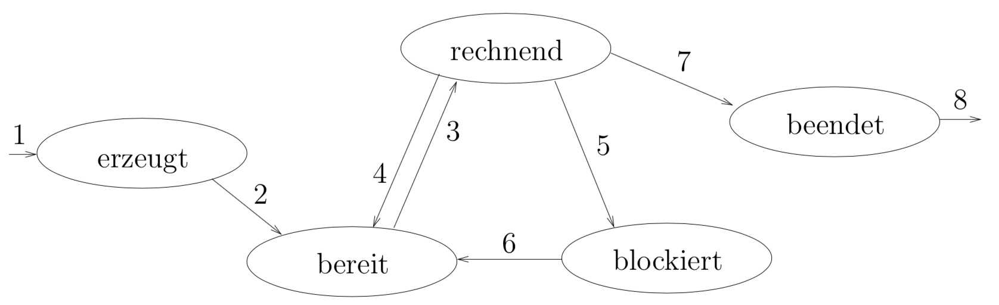

# Kurseinheit 2

## 2.1 Was ist ein Prozess? Was ist der Unterschied zu einem Programm

Informell: Ein Prozess ist die konkrete Ausführung eines laufenden Programmes.

**Programme**:

* *sequentiell*: Während der Ausführung des Programms wird zu jedem Zeitpunkt höchstens eine Anweisung des Programms ausgeführt.
* Ein Programm ist eine Formulierung eines Algorithmus (->welche Operationen werden in welcher Reihenfolge ausgeführt).
* Programmtext ist die vollständige Beschreibung des Programms

**Prozess**:

* ablaufendes Programm inklusive des aktuellen Stands des Befehlszählers, der Registerinhalte und seines Hauptspeicherbereichs mit den Belegungen der Variablen.

Analogie Tanenbaum:

* Rezept = Programm
* Mensch = Prozessor
* Zutaten = Eingabedaten
* Vorgang des Backens = Prozess

## 2.2 Was gehört zu einem Prozess?

Programmsegment, Stacksegment, Datensegment und Prozesskontrollblock => ***Prozessabbild***

## 2.3 Was steht im Prozesskontrollblock?

Alle Daten, die das Betriebssystem über einen Prozess verwalten muss:

* eindeutige Prozess-ID + Prozess-Zustand
* Speicherbereich des Prozesses
* Programmzählerstand
* Inhalte der Prozessorregister
* Informationen über geöffnete Dateien
* Abrechnungs- und Statistikinformationen

## 2.4 Welche Zustände hat ein Prozess? Welche Übergänge gibt es

Bis auf rechnend werden die Prozesse je Zustand in Listen verwaltet

* **erzeugt**: Prozess inkarniert, OS erstellt Datenstrukturen und weist Adressraum (Programmsegment, Datensegment, Stacksegment und Prozesskontrollblock) zu
* **bereit**: Rechenbereit und wartet auf Prozessor
* **rechnend**: Prozessor zugeteilt und Abarbeitung des Programms (pro Prozessor max. ein Prozess in diesem Zustand)
* **blockiert**: Prozess wartet auf Ereignis (z.B. E/A)
* **beendet**: Ausführungsende erreicht

## 2.5 Bei einem Einprozessorsystem läuft zu jedem Zeitpunkt genau ein Prozess. Warum laufen die Prozesse trotzdem scheinbar parallel?

Abhängig von der Scheduling-Strategie findet für den Benutzer ein nahezu unbemerkbar schneller Wechsel zwischen den Prozessen statt. Dadurch kommen (die interaktiven) Prozesse ungefähr gleich viel CPU-Zeit pro Zeitabschnitt und der Anwender hat den Eindruck einer parallelen Ausführung der Prozesse.

### 2.5.1 Wie kann einem Prozess der Prozessor entzogen werden? Welche Hardware übernimmt diese Aufgabe, damit das Betriebssystem die Kontrolle wieder zurück erhält?

Bei präemptiven Systemen startet ein Timer (Hardware) zu Beginn jedes rechnenden Prozesses. Nach Ablauf einer bestimmten Zeitscheibe (z. B. 100 ms) erzeugt der Timer eine Unterbrechung (Interrupt) und das Betriebssystem erhält die Kontrolle zurück.

## 2.6 Was macht der Scheduler

Der Scheduler legt fest, welcher Prozess als nächster den Prozessor erhalten soll.

### 2.6.1 Wer entscheidet, welcher Prozess vom Zustand bereit in den Zustand rechnend geht

Der Scheduler entscheidet, welcher Prozess vom Zustand bereit zum Zustand rechnend geht, d.h. die Reihenfolge der Prozesse in der Warteschlange realisiert (präsentiert) genau die Scheduling-Strategie, die der Scheduler gewählt hat.

### 2.6.2 Warum geht ein Prozess vom Zustand rechnend zum Zustand bereit

Ein Prozess, welcher aktuell rechnet, aber dessen Zeitscheibe abgelaufen ist, geht in den Zustand bereit über. Dies passiert so lange, bis entweder die Abarbeitung des Programms fertig ist oder auf ein E/A-Vorgang gewartet wird (der Prozess also blockiert).

## 2.7 Wer ist für das Umschalten des Prozessors zwischen Prozessen zuständig

Die Umschaltung macht der Dispatcher (Teil des Betriebssystem).

### 2.7.1 Welche Aufgaben müssen beim Umschalten gemacht werden

* Anhalten des rechnenden Prozesses. Der Prozessor ist dem Prozess entzogen und dem BS zugeordnet.
* Sichern der Informationen über den bisherigen Prozess in dessen PCB.
* Aus dem PCB des nächsten Prozesses dessen alten Zustand wieder herstellen. Der nächste Prozess stammt aus der Menge der Prozesse im Zustand „bereit“.
* Den Prozessor an den neuen rechnenden Prozess übergeben. Dieser wechselt dann in den Zustand „rechnend“.

Bei heute üblichen Systemen schaltet das BS den Prozessor mehrmals pro Sekunde zwischen verschiedenen Prozessen hin und her.

## 2.8 Wann findet eine Prozessumschaltung statt

* Ein Prozess will einen **Systemaufruf** durchführen
* **Timerinterrupt**
* **Abarbeitung des Programms** abgeschlossen
* Unterbrechung durch **Ein-/Ausgabegerät**
* rechnender Prozess hat Fehler (**Trap**)
* Prozess greift auf Speicherseite zu, die nicht im Hauptspeicher ist (**Seitenfehler**)

### 2.8.1 Was ist die Beziehung zwischen Prozesswechsel und Moduswechsel

Damit ein Prozesswechsel statt finden kann, muss die CPU vorher aus dem Benutzermodus in den Systemmodus wechseln, da die *interrupt service routines* nur durch privilegierte Befehle aufgerufen werden können. Einem Prozesswechsel geht also immer ein Moduswechsel voraus.

## 2.9 Was heiflt nicht-präemptiv? Was heiflt präemptiv

* Bei **nicht-preämptiven** Betriebssystemen entscheidet nur Prozess selbst, ob er den Prozessor wieder abgeben möchte.
* Bei **preämptiven** Systemen entzieht das BS einem laufenden Prozess den Prozessor.

## 2.10 Welche Qualitätsmerkmale von Scheduling-Strategien gibt es

* Maximale Effizienz, d.h. hohe Prozessorauslastung
* Minimale Antwortzeiten
* Minimale Durchlaufzeiten
* Maximaler Durchsatz
* Fairness, also gerechte Verteilung des Prozessors.

### 2.10.1 Können sie gleichzeitig erfüllt werden? Welche Konflikte gibt es zwischen den Qualitätsmerkmalen

Nein, da Strategien teilweise inkompatibel: Langes, heftiges Numbercrunching lastet den Prozessor voll aus, leichtgewichtiger Texteditor kommt erst nach langer Wartezeit zum Zug (=Fairness verletzt).

### 2.10.2 Was ist mit Fairness gemeint

Die gerechte Verteilung des Prozessors innerhalb eines Zeitabschnitts.

## 2.11 Welche Scheduling-Strategien mit Vor- und Nachteilen sind geeignet für ein Batchbetrieb

* First Come, First Serve:
    * **Vorteile**:
        * Einfache Implementierung
        * geringer Verwaltungsaufwand
        * Fair
    * **Nachteile**:
        * kurze Prozesse müssen ggf. lange warten

Grundsätzlich alle nicht-präemptiven Strategien für den Batchebtrieb geeignet

## 2.12 Welche Scheduling-Strategien mit Vor- und Nachteilen sind geeignet für ein nicht-kooperativen (präemptiv) interaktiver Betrieb

Mit der Strategie „Multiple Queues“ werden Prozesse in verschiedene Klassen eingeteilt:

* Systemprozesse
* Dialogprozesse
* Hintergrundprozesse (batch jobs).

Für jede Klasse ist ein eigener Scheduler zuständig. Gesamtscheduling so eingestellt, dass Dialogprozesse bevorzugt werden.

### 2.12.1 Wie kann man diese Strategien so einstellen, dass sie interaktive Prozesse bevorzugen

## 2.13 Beschreiben Sie die einzelnen Scheduling-Strategien mit Vor- und Nachteilen

### 2.13.1 Scheduling für nicht-präemptive Systeme

* **First Come First Served (FCFS)**: Prozesse werden nach Eingangsreihenfolge vom Prozessor bearbeitet.
    * **Vorteile**:
        * einfach zu implementieren (FIFO-Queue)
        * Zeitbedarf für Einfügen + Entfernen konstant
        * Fairness, da alle Prozesse der Reihe nach den Prozessor erhalten.
    * **Nachteile**
        * kurz laufende Prozesse müssen u. U. sehr lange warten, daher für Dialogsysteme nicht geeignet.
* **Shortest Job First (SJF)**: Der Prozess mit der kürzesten Bedienzeit bekommt den Prozessor zuzuordnen (bei gleicher Zeit: FCFS).
    * **Vorteile**:
        * Garantiert die minimale Wartezeit für eine feste Menge von Prozessen mit bekannten Bedienzeiten
        * Kurz laufende Prozesse werden nicht benachteiligt
        * Algorithmus ist relativ leicht zu implementieren, falls die Dauer des nächsten CPU bursts bekannt ist.
    * **Nachteile**
        * Langläufer müssen eventuell ewig warten.
        * Die Dauer des nächsten CPU bursts ist nicht bekannt und kann nur geraten bzw. geschätzt werden.
        * größerer Verwaltungsaufwand O(log n).

* **2.5.2.3 Priority Scheduling**: Prozesse werden in unterschiedlich wichtige Klassen einteilt. Zuerst bekommen die Prozesse der wichtigsten Klasse den Prozessor zugeteilt, dann erst die der weniger wichtigen Klassen.
    * Prioritäten können dabei **intern** (z. B. vom Hauptspeicherbedarf, Plattenspeicherbedarf, der Anzahl der geöffneten Dateien, der bisher verbrauchten Rechenzeit usw.) oder **extern** (Benutzer) vergeben werden.
    * *Statische* Priorität bedeutet, dass jeder Prozess eine Priorität zugeordnet bekommt und und diese bis zu seinem Ende behält. Prozesse mit niedriger Priorität müssen u.U. ewig warten
    * **Vorteile**
        * Wichtige Aufgaben werden schnell erledigt.
    * **Nachteile**
        * Bei statischer Prioritätsvergabe nicht fair, da Prozesse dann verhungern können.
        * Wie die Prioritäten festgelegt werden sollen, ist nicht so ohne weiteres klar.

## 2.14 Welche theoretische Eigenschaft hat die SJF-Strategie? Was sind die Nachteile von SJF

1. Langlaufende Prozesse können verhungern (**starvation**), wenn sich immer kurze Prozesse vordrängeln.
2. Der Scheduler muss wissen, wie lange ein die Bedienzeit des nächsten Prozesses ist

### 2.14.1 Wie kann man CPU bursts abschätzen

Man geht davon aus, dass ein Prozess, der bisher immer nur kurze CPU bursts hatte, auch in Zukunft mit großer Wahrscheinlichkeit nur kurze CPU bursts haben wird. Ein Prozess mit großen CPU bursts hat auch in Zukunft wahrscheinlich wieder große CPU bursts.

## 2.15 Wie wird die Priorität festgelegt, wenn man die SJF-Strategie und die FCFS-Strategie als Priorität-Strategie betrachtet

* **SJF**: Je kleiner die Bedienzeit eines Prozesses ist, desto höher ist seine Priorität.
* **FCFS**: Die zuerst ankommenden Prozesse erhalten eine hohe Priorität, die späteren eine entsprechend niedrigere.

## 2.16 Wie wird die Zeitscheibe festgelegt, wenn man die FCFS-Strategie als Round Robin betrachtet

Jeder Prozess hat die Größe der Zeitscheibe unendlich.

## 2.17 Wie soll man die Länge einer Zeitscheibe wählen? Was muss man bei der Auswahl einer Zeitscheibe beachten? Welche Probleme können bei zu langer oder zu kurzer Zeitscheibe entstehen?

* Wählt man das Quantum zu **klein**, gibt es ein ungünstiges Verhältnis `Verwaltungsaufwand <-> „echte Arbeit“`. Im worst case ist der Prozessor nur mit der Prozessumschaltung beschäftigt und fast gar nicht mit „echter“ Arbeit.
* Wählt man Quantum zu **groß**, werden die Wartezeiten für die interaktiven Benutzer unzumutbar groß.

Eine sinnvolle Größe für das Quantum ist ein Wert, der etwas größer als die für eine übliche Interaktion erforderliche Zeit ist, typischerweise in Millisekunden-Größenordnungen.

## 2.18 Was ist ein Thread? Was ist der Unterschied zu einem Prozess? Was haben die Threads eines Prozesses gemeinsam

Ein Thread ist ein leichtgewichtiger Prozess. Mit Hilfe von Threads lassen sich parallele Aktivitäten innerhalb eines Prozesses beschreiben. Ein Prozess kann aus mehreren Threads bestehen.

Ein Thread ist definiert durch seinen eigenen

* Registersatz
* Programmzähler
* Stackbereich

Programm- und Datensegment teilen sich die verschiedenen Threads eines Prozesses.

### 2.18.1 Welche Vorteile haben Threads

* **Effiziente Kommunikation**: Threads können direkt miteinander kommunizieren, indem sie das gemeinsame Datensegment für den Informationsaustausch verwendet.
* **Erreichbarkeit**: Wenn ein Prozess blockiert, so muss nur ein Thread blockiert werden, während die anderen Threads weiterarbeiten können.
* **Ressourcenteilung**: Es ist möglich, dass verschiedene Prozesse auf die gleichen Ressourcen, z.B. Datenspeicher u. Prozessorressourcen zugreifen.
* **Mehr Effizienz**: Bei einem Wechsel der rechnenden Threads nur die Register ausgetauscht werden. Auch im Vergleich zum Erzeugen von weiteren echten Prozessen ist es günstiger, neue Threads zu kreieren.

### 2.18.2 Was ist der Unterschied zwischen Kernel-Threads und Benutzer-Threads

#### Benutzer-Threads

* Kernel hat keinerlei Kenntnis davon, ob ein Prozess mehrere Threads verwendet.
* Jeder Prozess hat eigenen, privaten Thread-Kontrollblock, analog zum PCB.
* Eigenes Scheduling der Threadsa
* Nachteil: Der ganze Prozess blockiert, wenn ein Benutzer-Thread blockiert.

#### Kernel-Threads

* Ähnliche Verwaltung der Threads wie bei Prozessen (Es gibt eine Tabelle von Prozessen und Threads, die alle am Scheduling des BS-Kerns teilnehmen)
* Realisierung ist aufwändiger
* zusammengehörige Kernel-Threads können in Multiprozessor-Systemen auf mehreren Prozessoren parallel ablaufen.

### 2.18.3 Welche Threads können in Multiprozessor-Rechner auf mehreren Prozessoren parallel einsetzt werden

Es können im Multiprozessor-Rechnern nur Kernel-Threads parallel eingesetzt werden, da das Betriebssystem bei Benutzer-Threads keine Kenntnis davon haben kann, ob der aktuelle Prozess mehrere parallel ausführbare Threads hat.

### 2.18.4 Welche Scheduling-Strategien kann man bei Benutzer-Threads verwenden? Warum

Es kommen nur nicht-preämptive Scheduling-Strategien in Frage. #TODO: Warum

### 2.18.5 Warum kann man nur nicht-präemptive Scheduling-Strategien bei Benutzer-Threads verwenden

Ein Benutzer-Thread kann nicht ohne besonders trickige Programmierung von seinem eigenen Prozess zu einer Unterbrechung gezwungen werden