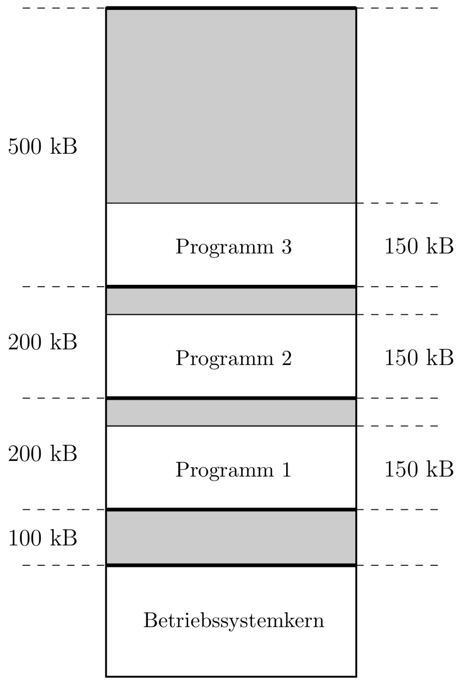

# Kurseinheit 3

## 3.1 Mit welchen Mechanismen oder Strategien kann man die folgenden Anforderungen zur Speicherverwaltung erfüllen?

### 3.1.1 Es muss möglich sein, dass einem Prozess dynamisch einen verschiebbaren Teil vom Hauptspeicher zugewiesen wird und diese Zuweisung transparent für die Programmierer sein soll. (Basisregister, logische Adressen)

### 3.1.2 Das Konzept der Modularisierung von Programmen soll unterstützt werden. (logische Adressen, dynamisches Binden, paging)

### 3.1.3 Die Isolierung des Speichers jedes einzelnen Prozesses (durch die Hardware) muss realisiert werden. (Basis- und Grenzenregister)

### 3.1.4 Die gemeinsame Benutzung von Programmsegmenten (shared memory) soll möglich sein. (paging, Einblenden)

### 3.1.5 Das Konzept des virtuellen Speichers soll realisiert werden. (logische Adressen, MMU, paging, Auslagerungs- und Arbeitsmengestrategien)

## 3.2 Was ist der Unterschied zwischen logischen und physischen Adressen?  

Eine **physische Adresse** ist eine reale Adresse einer Speicherzelle in einem Hauptspeicher. Über die physische Adresse kann jede Speicherzelle einzeln adressiert werden.

## 3.3 Was ist der Unterschied zwischen absoluten und relativen Adressen?

Lader möchte Programm laden und dafür sorgen muss, dass die im geladenen Programm auftretenden Adressen im logischen Adressraum des Prozesses liegen. Hierzu gibt es zwei Möglichkeiten:

1. Wenn bereits der Binder die Adressen des logischen Hauptspeichers kennt, der bei der Ausführung des zu erzeugenden Lademoduls verfügbar sein wird, kann er bereits passende Adressen erzeugen. Diese Adressen nennt man auch "absolute Adressen." Nachteil der absoluten Adressen ist, dass das Lademodul nur noch an genau diesen Bereich logischer Adressen geladen werden kann.
2. Abhilfe schaffen die relativen Adressen. Hier kann das Lademodul an einen beliebigen logischen Adressbereich geladen werden. Der Binder nimmt an, dass im logischen Hauptspeicher von 0 an nummerierte Adressen zur Verfügung stehen. Diese Adressen nennt man "relative Adressen." Der Laden muss beim Laden dann nur noch die Startadresse des verfügbaren Bereichs logischer Adressen aufaddieren, um die im Programm auftretenden relativen Adressen in absolute umzuformen

### 3.3.1 Welche Vorteile haben relative Adressen?

Ein Prozess braucht nicht die physischen Adressen bei der Ausführung eines Prozesses zu wissen, weil die logische Adresse mit Hilfe der MMU in die physische Adresse umgesetzt wird, bevor ein Zugriff auf den Hauptspeicher stattfindet.

## 3.4 Ein Programm besteht aus vielen verschiedenen Moduln. Was muss gemacht werden, damit das Programm ausführbar wird?

## 3.5 Welche Speicherzuweisungsstrategien zur Verwaltung des Hauptspeichers gibt es?
(Einfach zusammenhängend, mehrfach zusammenhängend, MFT, MVT, Bude, Paging.
Bei MVT gibt es bei der Auswahl eines freien Segments Verfahren: First Fit, Next Fit, Best Fit, Worst Fit und Buddy.

* **Einfach zusammenhängende Speicherzuweisung**: Es befindet sich zu jedem Zeitpunkt maximal ein Benutzerprozess im Hauptspeicher.
* **Mehrfach zusammenhängende Speicherzuweisung**: Mehrere Programme und deren Daten werden nebeneinander aufgenommen.
* **MFT**: multiprogramming with a fixed number of tasks.
    * Fixe Segmentgrößen im Speicher
    * unmöglich, günstige Segmentgrößen zu finden, da die benötigten Größen i.d.R. nicht vorher
    abgeschätzt werden können  
    * Scheduling-Strategie: einem Auftrag das kleinste zur Verfügung stehende Segment zugewiesen, also kein unnötig großes (best-available-fit)

## 3.6 Ein Programm mit logischen Adressen wird zur Ausführung in den Hauptspeicher geladen. Welche Hardware-Unterstützung braucht man, um den Zugriff einer physischen Adresse des Programms zu realisieren?

### 3.6.1 Wie kann man mit dieser Unterstützung den Speicherschutz realisieren?

Das BS belegt im Arbeitsspeicher die Adressen von *0* bis *a* Byte. Ein Anwenderprogramm darf nicht (absichtlich oder unabsichtlich) auf einen Bereich < *a* zugreift. Darüber hinaus darf es auch nicht aus dem Speicherbereich anderer Anwendungsprogramme lesen.

1. unsichtbares **Basisregister** (Wert=*a*) enthält und benutzt im Anwenderprogramm nur Relativadressen zur Basis *a*. Das Anwenderprogramm läuft nun in einem virtuellen Adressraum ab und kann nicht auf Adressen < a zugreifen.
2. Wenn logische Adressen jedoch unverändert als physische Adressen verwendet werden, kann man eine Unterbrechung erzeugen, wenn ein Anwenderprogramm auf eine Adresse < a zugreift. Hierzu ist ein **Grenzregister** erforderlich, welches die derzeitige Grenze zwischen dem geschützten und ungeschützten Bereich, also den Wert *a*, enthält.

## 3.7 Was ist eine interne Fragmentierung? Was ist eine externe Fragmentierung?

### 3.7.1 Welche Fragmentierung haben die Speicherzuweisungsstrategien MFT, MVT, Bude, Paging?

## 3.8 Was ist Paging?

### 3.8.1 Was ist der Unterschied zwischen einer Seite und einem Segment?

### 3.8.2 Wie sieht eine logische Adresse bei paging aus?

### 3.8.3 Wie wird eine logische Adresse bei paging auf eine physische Adresse abgebildet?
(Die Seitentabelle macht genau diese Abbildung)

### 3.8.4 Wer führt diese Abbildung durch?
(MMU, siehe Abbildung 3.15 im Kurstext)

### 3.8.5 Was ist MMU? Warum ermöglicht der MMU, dass ein Prozess nur die logischen Adressen zu kennen braucht?

In der MMU (Memory Management Unit) werden logische Adressen in physische Adressen umgeformt. Physisch ist die MMU entweder in der CPU integriert oder nahe angeordnet, logisch gesehen liegt sie zwischen CPU und Hauptspeicher.

### 3.8.6 Wie kann eine Seite individuell geschützt werden?
(Protection-Bit)

### 3.9 Was ist Shared Memory? Wie funktioniert sie?

### 3.9.1 Was ist der Vorteil?

### 3.9.2 Welche Probleme können entstehen, wenn mehr als ein Prozess eine Shared Memory modifiziert?
(Inkonsistenz, Inkorrekt)

### 3.9.3 Was muss gemacht werden, damit diese Probleme vermeiden werden können?
Synchronisierung der Prozesse)

## 3.10 Wie oft wird der Hauptspeicher mindestens bei paging zugegriffen, wenn ein Wort im Hauptspeicher geholt wird?

## 3.11 Wie kann der Zugriff eines Worts im Hauptspeicher bei paging mit TLB beschleunigt werden?

## 3.12 Wie kann man die Seitentabelle verwalten, wenn sie zu grofl ist?
(mehr stufige Seitentabelle)

## 3.13 Was ist die Idee (das Ziel) des virtuellen Speichers?
(Schreiben eines Programms ohne Einschränkung der Gröfle des Hauptspeichers, Zerlegung von Programmen, nur der Teil im Hauptspeicher bleibt, der gerade gebraucht wird. Die Trennung zwischen logischen und physischen Adressen und die Unterstützung von MMU machen Programme verschiebbar und die Realisierung des Konzepts möglich. Virtueller Hauptspeicher unterstützt die Unabhängigkeit der Software von der Hardware.  Die Lokalitätseigenschaft unterstützt die Effizienz. Das Betriebssystem realisiert das virtuelle Konzept, so dass es transparent für Benutzer und Benutzerprozesse ist. )

## 3.14 Was ermöglicht die Realisierung des Konzepts des virtuellen Speichers?
(Prozesse arbeiten nur mit logischen Adressen, die physischen Adressen werden erst zur Ausführungszeit mit Hilfe von Hardware MMU abgebildet--> Relokierbarkeit, paging-Technik, Seitentabelle-->Anwesenheit einer Seite, Auslagerungsbereich im Sekundärspeicher.)

## 3.15 Was wird gebraucht, um das virtuelle Hauptspeicher-Konzept mit paging zu realisieren?
(Seitentabelle, Swap-bereich)

## 3.15.1 Wie sieht eine virtuelle Adresse aus?

## 3.15.2 Warum ist der virtuelle Hauptspeicher byteweise adressiert?
(Abbildungsweise einer virtuellen Adresse)

## 3.16 Was muss das Betriebssystem bei der Erzeugung eines Prozesses tun, wenn das virtuelle Hauptspeicher-Konzept mit paging realisiert wird?

## 3.17 Was ist ein Seitenfehler?

### 3.17.1 Was passiert bei einem Seitenfehler?

### 3.17.2 Wie wird ein Seitenfehler erkannt?

### 3.17.3 Was muss das Betriebssystem bei einem Seitenfehler tun?

## 3.18 Welche Ladestrategien gibt es?  
(d.h. wann soll eine Seite in den Hauptspeicher geholt werden?)

### 3.18.1 Was heiflt demand paging? Was heiflt prepaging?

## 3.19 Was heiflt Lokalität eines Prozesses?

## 3.20 Was ist die Speichereinblendung von Datei?

## 3.21 Welche Seitenauslagerungsstrategien gibt es?

### 3.21.1 Welche Seitenrahmenzuweisungsstrategien gibt es?

### 3.21.2 Wie viele Seitenrahmen sollten einem Prozess zugewiesen werden?

## 3.22 Was ist Seitenflattern?
