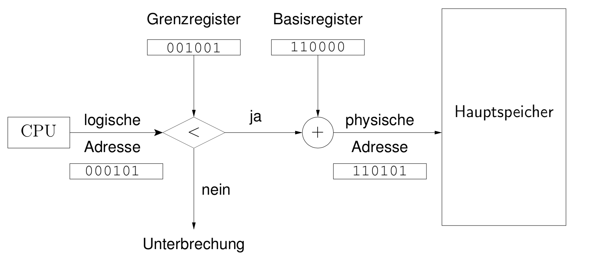
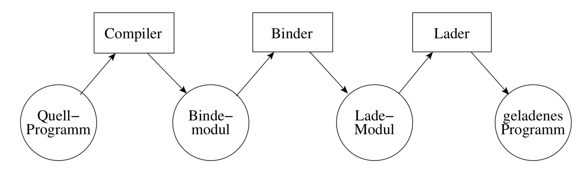
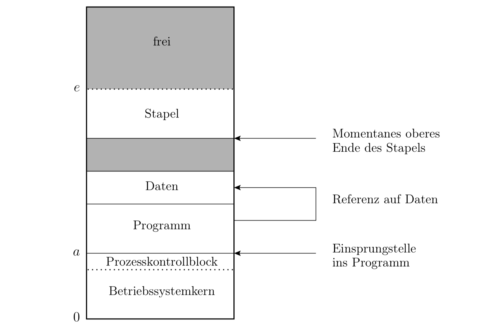
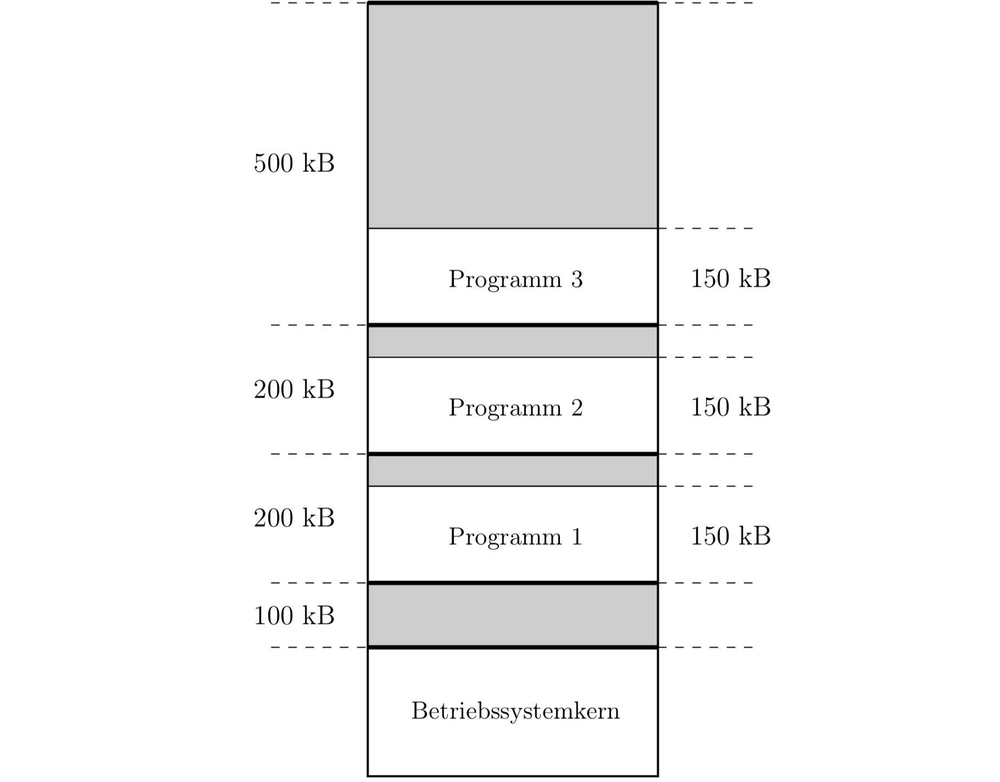
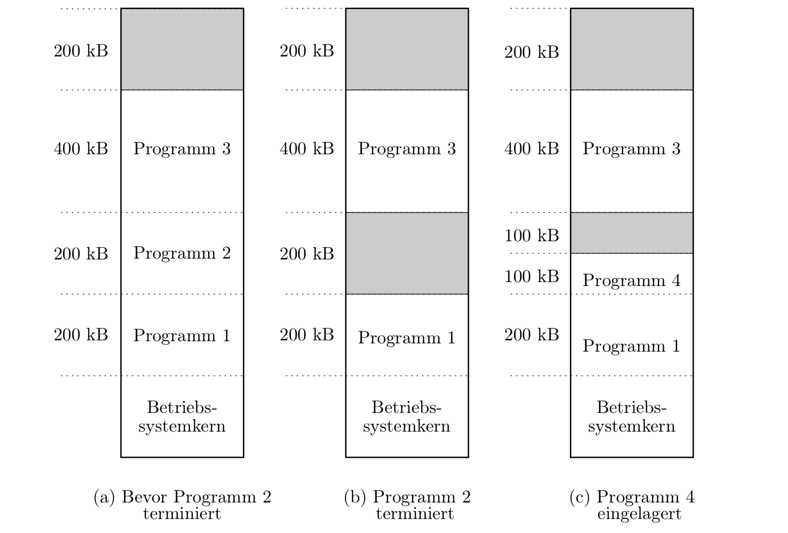
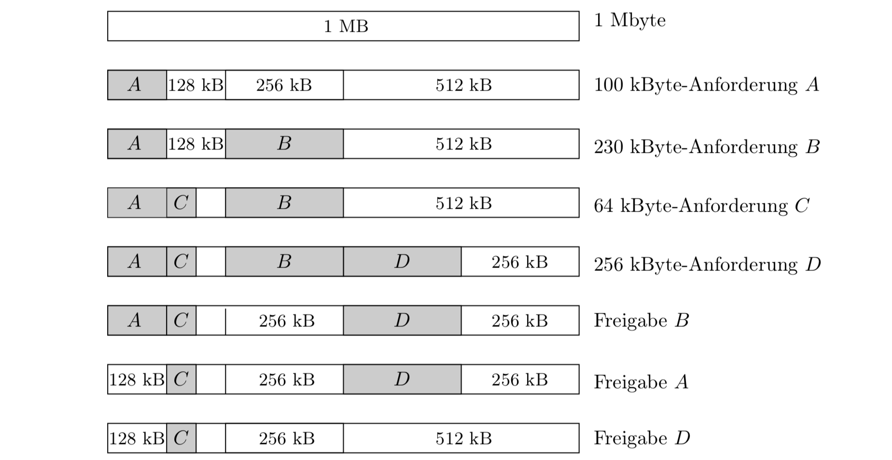
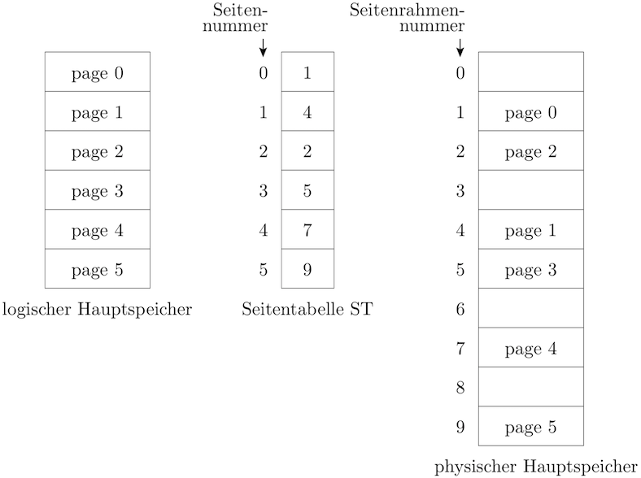

# Kurseinheit 3

## 3.1 Mit welchen Mechanismen oder Strategien kann man die folgenden Anforderungen zur Speicherverwaltung erfüllen

### 3.1.1 Es muss möglich sein, dass einem Prozess dynamisch einen verschiebbaren Teil vom Hauptspeicher zugewiesen wird und diese Zuweisung transparent für die Programmierer sein soll

Den physischen Hauptspeicheradressen werden logische Adresse zugewiesen. Ein logischer Speicherbereich kann dann ab einem *Basisregister* (für eine Anwendung ist dies immer Adresse **0**) bis zur vorgegebenen Größe belegt werden. Die Anwendung hat somit einen eigenen, virtuellen Speicherbereich, aus welchem Sie nicht ausbrechen kann.

### 3.1.2 Das Konzept der Modularisierung von Programmen soll unterstützt werden

Eine logische Adresse ist hardwareunabhängig: sie zeigt auf einen Ort unabhängig von der konkreten Zuweisung zwischen Datenbereichen und physischem Hauptspeicher. Vor jedem Zugriff auf eine logische Adresse muss diese zunächst in eine physische Adresse übersetzt werden. Die MMU bildet logische Adressen auf physische Adressen im Hauptspeicher ab.

(logische Adressen, dynamisches Binden, paging)

### 3.1.3 Die Isolierung des Speichers jedes einzelnen Prozesses (durch die Hardware) muss realisiert werden

Das **Grenzregister** ist die Grenze, ab welchem im Hauptspeicher Adressbereich für Applikationen vergeben werden können. Das Grenzregister kann im Kernelmodus gesetzt werden.

Das **Basisregister** ist die Startadresse für den virtuellen Speicherbereich

### 3.1.4 Die gemeinsame Benutzung von Programmsegmenten (shared memory) soll möglich sein

(paging, Einblenden)

### 3.1.5 Das Konzept des virtuellen Speichers soll realisiert werden

(logische Adressen, MMU, paging, Auslagerungs- und Arbeitsmengestrategien)

## 3.2 Was ist der Unterschied zwischen logischen und physischen Adressen

Eine **physische Adresse** ist eine reale Adresse einer Speicherzelle in einem Hauptspeicher. Über die physische Adresse kann jede Speicherzelle einzeln adressiert werden.

## 3.3 Was ist der Unterschied zwischen absoluten und relativen Adressen

Lader möchte Programm laden und dafür sorgen muss, dass die im geladenen Programm auftretenden Adressen im logischen Adressraum des Prozesses liegen. Hierzu gibt es zwei Möglichkeiten:

1. Wenn bereits der Binder die Adressen des logischen Hauptspeichers kennt, der bei der Ausführung des zu erzeugenden Lademoduls verfügbar sein wird, kann er bereits passende Adressen erzeugen. Diese Adressen nennt man auch "absolute Adressen". Nachteil der absoluten Adressen ist, dass das Lademodul nur noch an genau diesen Bereich logische Adressen geladen werden kann.
2. Abhilfe schaffen die relativen Adressen. Hier kann das Lademodul an einen beliebigen logischen Adressbereich geladen werden. Der Binder nimmt an, dass im logischen Hauptspeicher von 0 an nummerierte Adressen zur Verfügung stehen. Diese Adressen nennt man "relative Adressen". Der Lader muss beim Laden dann nur noch die Startadresse des verfügbaren Bereichs logischer Adressen aufaddieren, um die im Programm auftretenden relativen Adressen in absolute umzuformen.

### 3.3.1 Welche Vorteile haben relative Adressen

Ein Prozess braucht nicht die physischen Adressen bei der Ausführung eines Prozesses zu wissen, weil die logische Adresse mit Hilfe der MMU in die physische Adresse umgesetzt wird, bevor ein Zugriff auf den Hauptspeicher stattfindet.

## 3.4 Ein Programm besteht aus vielen verschiedenen Moduln. Was muss gemacht werden, damit das Programm ausführbar wird

1. Ein Quellprogramm-Modul wird zunächst vom *Compiler* oder Assemblierer in ein *Bindemodul* übersetzt
2. Der **Binder** erzeugt ein *Lademodul*, das die aneinander grenzende Verknüpfung aller Bindemoduln darstellt
3. Das *Lademodul* wird vom **Lader** in den logischen Hauptspeicher des Prozesses geladen.

## 3.5 Welche Speicherzuweisungsstrategien zur Verwaltung des Hauptspeichers gibt es

### Einfach zusammenhängende Speicherzuweisung 

Es befindet sich zu jedem Zeitpunkt maximal ein Benutzerprozess im Hauptspeicher.

### Mehrfach zusammenhängende Speicherzuweisung

Mehrere Programme und deren Daten werden nebeneinander aufgenommen.

1. **MFT**: multiprogramming with a fixed number of tasks.
    * Fixe Segmentgrößen im Speicher
    * unmöglich, günstige Segmentgrößen zu finden, da die benötigten Größen i.d.R. nicht vorher abgeschätzt werden können
    * Scheduling-Strategie: einem Auftrag das kleinste zur Verfügung stehende Segment zugewiesen, also kein unnötig großes (best-available-fit). Trotzdem kommt es zu interner Fragmentierung

2. **MVT**: multiprogramming with a variable number of tasks.

Scheduling Strategien:

* **First Fit**: Die erste ausreichend große Lücke im Hauptspeicher wird belegt
* **Next Fit**: Die nächste ausreichend große Lücke im Hauptspeicher wird belegt
* **Best Fit**: Die am besten ausreichend große Lücke im Hauptspeicher wird belegt (=kleinster Verschnitt -> externe Fragmentierung)
* **Worst Fit**: Die am schlechtesten ausreichend große Lücke im Hauptspeicher wird belegt (große Reststücke)

* **Buddy**: Der zugewiesene Speicherplatz wird immer auf die nächsthöhere 2er-Potenz aufgerundet. Bei 100 angeforderten Bytes würden also 128 zugeteilt -> **interne Fragmentierung**

## 3.6 Ein Programm mit logischen Adressen wird zur Ausführung in den Hauptspeicher geladen. Welche Hardware-Unterstützung braucht man, um den Zugriff einer physischen Adresse des Programms zu realisieren

### 3.6.1 Wie kann man mit dieser Unterstützung den Speicherschutz realisieren

Das BS belegt im Arbeitsspeicher die Adressen von *0* bis *a* Byte. Ein Anwenderprogramm darf nicht (absichtlich oder unabsichtlich) auf einen Bereich < *a* zugreift. Darüber hinaus darf es auch nicht aus dem Speicherbereich anderer Anwendungsprogramme lesen.

1. unsichtbares **Basisregister** (Wert=*a*) enthält und benutzt im Anwenderprogramm nur Relativadressen zur Basis *a*. Das Anwenderprogramm läuft nun in einem virtuellen Adressraum ab und kann nicht auf Adressen < a zugreifen.
2. Wenn logische Adressen jedoch unverändert als physische Adressen verwendet werden, kann man eine Unterbrechung erzeugen, wenn ein Anwenderprogramm auf eine Adresse < a zugreift. Hierzu ist ein **Grenzregister** erforderlich, welches die derzeitige Grenze zwischen dem geschützten und ungeschützten Bereich, also den Wert *a*, enthält.

## 3.7 Was ist eine interne Fragmentierung? Was ist eine externe Fragmentierung

* **Interne Fragmentierung**: Entsteht dadurch, dass einem Prozess ein größerer Speicherbereich zugewiesen wird, als benötigt wird.
* **Externe Fragmentierung**: Bedeutet, dass nicht zugewiesene Speicherbereiche zu klein sind, um die Speicherplatzanforderungen von auf Ausführung wartenden Prozessen zu erfüllen.

### 3.7.1 Welche Fragmentierung haben die Speicherzuweisungsstrategien MFT, MVT, Buddy, Paging

Bei MFT tritt vorwiegend interne Fragmentierung auf, bei MVT externe. Bei Paging gibt es nur interne Fragmentierung.

## 3.8 Was ist Paging

Der logische Hauptspeicher wird in Einheiten einer bestimmten Größe unterteilt -> **Page/Seite**

### 3.8.1 Was ist der Unterschied zwischen einer Seite und einem Segment

Eine Seite hat ist ein logischer Speicherbereich mit einer vorgegebenen Größe, ein Segmet ist ein zusammenhängender Abschnitt des *physischen* Speichers

### 3.8.2 Wie sieht eine logische Adresse bei paging aus

Die logische Adresse wird in eine Seitennummer und einen Offset geteilt:
Eine Seite habe **p** Speicherzellen, die logische Adresse **v** liegt dann in Seite **s** und Offset **d** wobei

`s = v div p` und `d = v mod p`

Beispiel:

Seitengröße (p) = 5
logische Adresse (v) = 16
=>
Seitennummer (s) = 16/5 = **3**
Offset (d) = 16 *mod* 5 = **1**

### 3.8.3 Wie wird eine logische Adresse bei paging auf eine physische Adresse abgebildet

Der physische Speicher ist unterteilt - hier nennt man die einzelnen Stücke page frame (Seitenrahmen). Ein Seitenrahmen kann genau eine Seite des logischen Hauptspeichers aufnehmen. In der **Seitentabelle** ist vermerkt, in welchem Seitenrahmen welche Seite steht.

### 3.8.4 Wer führt diese Abbildung durch

### 3.8.5 Was ist MMU? Warum ermöglicht der MMU, dass ein Prozess nur die logischen Adressen zu kennen braucht

In der MMU (Memory Management Unit) werden logische Adressen in physische Adressen umgeformt. Physisch ist die MMU entweder in der CPU integriert oder nahe angeordnet, logisch gesehen liegt sie zwischen CPU und Hauptspeicher.

### 3.8.6 Wie kann eine Seite individuell geschützt werden

Es ist nun möglich, jede Seite individuell zu schützen. Wenn z.B. Programme und Daten auf verschiedenen Seiten stehen, kann das Programm gegen Schreiben geschützt werden und auf den Daten schreiben erlaubt werden. Hierzu enthält die Seitentabelle ein Protection-Bit (Schutzbit), welches durch die Hardware bei jedem Zugriff geprüft wird. Es können drei Bits benutzt werden, jeweils eines für Leserecht, Schreibrecht und Ausführungsrecht.

### 3.9 Was ist Shared Memory? Wie funktioniert Shared Memory? Was ist der Vorteil

Gemeinsam von mehreren Prozessen genutzter virtueller Hauptspeicher:

Wenn ein Prozess auf eine Seite des Shared Memory schreibt, erscheint der modifizierte Inhalt auch im Hauptspeicher des anderen Prozesses. Dies ist eine effiziente Art, Daten zwischen Prozessen auszutauschen, weil die Daten im physischen Hauptspeicher nicht mehr kopiert werden müssen.

### 3.9.2 Welche Probleme können entstehen, wenn mehr als ein Prozess eine Shared Memory modifiziert

Es kann zu Inkonsistenzen kommen (z.B. race conditions)

### 3.9.3 Was muss gemacht werden, damit diese Probleme vermeiden werden können

Synchronisierung der Prozesse ist notwendig.

## 3.10 Wie oft wird der Hauptspeicher mindestens bei paging zugegriffen, wenn ein Wort im Hauptspeicher geholt wird

* **TLB hit**: Es gibt nur einen Zugriff auf den Hauptspeicher.
* **TLB miss** Es gibt zwei Zugriffe auf den Hauptspeicher (unter der Annahme, dass wir eine einstufige Seitentabelle haben. Bei mehrstufigen Seitentabellen entsprechend mehr).

## 3.11 Wie kann der Zugriff eines Worts im Hauptspeicher bei paging mit TLB beschleunigt werden

Die komplette Seitentabelle wird im physischen Hauptspeicher abgelegt. Hieraus werden die aktuell benutzten Einträge in einem schnellen Assoziativspeicher **TLB(Translation Lookaside Buffer)** abgelegt.

Diese enthalten etwa 8 – 16 Einträge. Wenn im TLB eine gesuchte Seitennummer vorhanden ist (**TLB hit**), wird die zugehörige Seitenrahmennummer ausgegeben. Dieser Vorgang ist etwa 10mal schneller als ein Hauptspeicher-Zugriff.
Wenn die gesuchte Seitennummer nicht vorhanden ist **TLB miss**, wird die zugehörige Seitenrahmennummer aus der Seitentabelle geholt und in die TLB eingetragen. Hierbei muss i.d.R. ein schon vorhandener Eintrag verdrängt werden.

## 3.12 Wie kann man die Seitentabelle verwalten, wenn sie zu groß ist

Eine Seitentabelle darf so lang sein, wie eine Seite. Sollte man eine größere Tabelle benötigten, bietet sich eine mehrstufigen Seitentabellen an.

Diese Seitentabellen werden nicht nur im realen Speicher, sondern auch im virtuellen Speicher abgelegt (Ein Teil liegt im realen Speicher, ein Teil im virtuellen Speicher) -> Seitentabellen unterliegen dem Paging. So muss nicht mehr die gesamte Seitentabelle im physischen Speicher gehalten werden. Insbesondere Tabellen, die gerade nicht gebraucht werden, sollten nicht im Speicher liegen.

Bei einem zweistufigen Seitentabellen-Verfahren gibt es eine erste Stufe, bei der jeder Eintrag die Adresse oder Seitenrahmennummer einer Seitentabelle der zweiten Stufe enthält.

## 3.13 Was ist die Idee (das Ziel) des virtuellen Speichers? Was ermöglicht die Realisierung des Konzepts des virtuellen Speichers

* Schreiben eines Programms ohne Einschränkung der Größe des Hauptspeichers
* Zerlegung von Programmen (nur der Teil im Hauptspeicher bleibt, der gerade gebraucht wird)
* Trennung zwischen logischen und physischen Adressen und die Unterstützung von MMU machen Programme verschiebbar
* Virtueller Hauptspeicher unterstützt die Unabhängigkeit der Software von der Hardware, da Prozesse nur mit logischen Adressen arbeiten (physische Adressen werden erst zur Ausführungszeit mit Hilfe der MMU abgebildet)
* Die Lokalitätseigenschaft unterstützt die Effizienz.
* Das Betriebssystem realisiert das virtuelle Konzept (transparent für Benutzer und Benutzerprozesse)

## 3.15 Was wird gebraucht, um das virtuelle Hauptspeicher-Konzept mit paging zu realisieren

"Für jeden logischen Hauptspeicher brauchen wir also Platz auf einem Hintergrund-Speicher (i.A. einer Festplatte), dem sog. Swap-Bereich, der beim Start des BS reserviert wird."

Weiterhin brauchen wir eine Seitentabelle.

## 3.15.1 Wie sieht eine virtuelle Adresse aus

Die logische/virtuelle Adresse wird in eine Seitennummer und ein Offset geteilt.

## 3.15.2 Warum ist der virtuelle Hauptspeicher byteweise adressiert

(Abbildungsweise einer virtuellen Adresse)

## 3.16 Was muss das Betriebssystem bei der Erzeugung eines Prozesses tun, wenn das virtuelle Hauptspeicher-Konzept mit paging realisiert wird

Bei der Erzeugung eines Prozesses wird ein Speicherplatz für Programmsegment, Datensegment, Stacksegment und Prozesskontrollblock im Hauptspeicher reserviert. Bei Paging verteilt sich diese Speicherreservierung auf physischen und virtuellen Speicher.

Bei der Erzeugung eines Prozesses muss man folglich eine Seitentabelle im Hauptspeicher initialisieren und einen Swap-Bereich im Sekundärspeicher reservieren.

## 3.17 Was ist ein Seitenfehler(page fault)? Was passiert bei einem Seitenfehler

Eine Seite befindet sich beim versuchten Zugriff nicht im Hauptspeicher. Die Abarbeitung des Befehls wird zunächst einmal abgebrochen und eine Unterbrechung wird ausgelöst. Nun wird die Seite vom Hintergrundspeicher in einen freien Seitenrahmen eingelagert.
Da dies u.U. dauert, wird ein Prozesswechsel durchgeführt, falls ein anderer Prozess ausführungsbereit ist. Schließlich wird der unterbrochene Prozess fortgesetzt und der abgebrochene Befehl erneut ausgeführt, diesmal ohne Seitenfehler.

### 3.17.2 Wie wird ein Seitenfehler erkannt

Der Prozess kann nicht auf die gewünschte Seite zugreifen und löst eine Unterbrechung (*Trap*) aus

### 3.17.3 Was muss das Betriebssystem bei einem Seitenfehler tun

Einen Seitenrahmen auslagern, um die gesuchte Seite einzulagern

## 3.18 Welche Ladestrategien gibt es

1. demand paging
2. prepaging

### 3.18.1 Was heißt demand paging? Was heißt prepaging

* **demand paging**: Seiten werden immer erst bei Bedarf eingelagert werden, nie auf Vorrat.
* **prepaging**: Seiten eingelagert, die aktuell noch nicht, vermutlich aber in Zukunft benötigt werden. Das prepaging erweist sich wegen des Verdrängens schon vorhandener Seiten normalerweise als nachteilig und wird nur in Ausnahmefällen angewandt.

## 3.19 Was heißt Lokalität eines Prozesses

Unter der Lokalität des Zugriffsverhaltens von Prozessen verstehen wir, dass überwiegend hintereinander stehende Instruktionen oder Schleifen, die nur wenige Seiten umfassen, ausgeführt werden und selten zu weiter entfernt liegenden Programmteilen gesprungen wird. Es ist daher möglich, nur einen Teil des gesamten Programms im physischen Hauptspeicher zu halten.

## 3.20 Was ist die Speichereinblendung von Datei

Der Prozess sieht dann im virtuellen Hauptspeicher die Daten, die in der Datei stehen. Verändert er diese Daten, verändert er implizit auch den Inhalt der Datei.

Dies ist eine Alternative zum klassischen E/A-Verfahren.

Vorteile:

* Es wird immer nur auf einen kleinen Teil der Datei direkt zugegriffen (Datei muss nicht erst geladen werden, um dann HDD, RAM und Swap zu belegen)
* IPC: Eine Datei wird in mehrere Adressräume eingeblendet

## 3.21 Welche Seitenauslagerungsstrategien gibt es

* **FIFO**(First-In-First-Out)
    - leicht implementierbar
    - deutlich höhere Seitenfehlerrate
    - Nachteil: FIFO lagert auch laufend intensiv genutzte Seiten aus.
* **Second Chance**
    - FIFO-Erweiterung
    - Ausgabepuffer
    - Seiten werden nicht sofort ausgelagert
    - ineffizient
* **Clock-Algorithmus**
    - andere Implementierung von Second-Chance
    - Schlange wird durch zirkuläre Liste erreicht
    - Seite eingelagert: R-Bit = 0
    - Seite benutzt: R-Bit = 1
    - Auslagerung geschieht wie folgt: Zeiger findet Seite mit R-Bit=1 => R-Bit=0. Zeiger findet Seite mit R-Bit=0 => Auslagerung
* **LRU**(Least Recently Used)
    - eigentlich eine sehr gute Strategie
    - Problem: effiziente Implementierung
    - ohne aufwändige Hardware-Unterstützung nicht implementierbar
* **Zugriffsbit**
    - Idee ist ähnlich wie LRU, doch man merkt sich nicht den exakten Zeitpunkt, sondern eine Beobachtungsperiode.
    - Realisierung über Zugriffsbit (Referenced-Bit; kurz: R-Bit)

### 3.21.1 Welche Seitenrahmenzuweisungsstrategien gibt es

* einfache Strategie: die vorhandenen Seitenrahmen gleichmäßig auf die im System vorhandenen Prozesse verteilen (schlechte Strategie)
* Bessere Strategien berücksichtigen:
    - Das Zugriffsverhalten jedes einzelnen Prozesses (*lokale Kriterien*)
    - Gesamtbelastung des Rechnersystems (*globale Kriterien*)

### 3.21.2 Wie viele Seitenrahmen sollten einem Prozess zugewiesen werden

Es gibt keine feste Zuweisung, da die Zuweisung etwas dynamisches ist.

Zu Beginn keine Zahl festgelegt werden, wie viele Seitenrahmen ein Prozess bekommen sollte. Es gibt hierfür jedoch zwei Strategien:

1. Die **Arbeitsmengenstrategie** besteht darin, einem Prozess zu einem bestimmten Zeitpunkt so viel Seitenrahmen zuzuweisen, wie dessen aktuelle Arbeitsmenge groß ist. Bei jedem Seitenfehler wird einem Prozess ein weiterer Seitenrahmen zugewiesen.
2. **Kontrolle der Seitenfehlerrate**: Wenn ein Seitenfehler auftritt, registriert das BS die Zeit t, die seit dem letzten von diesem Prozess verursachten Seitenfehler vergangen ist. Man legt einen Grenzwert T fest. Wenn t <= T, wird dem Prozess noch eine Seite mehr zugeteilt.

## 3.22 Was ist Seitenflattern(Trashing)

Systemüberlastung, welche dann auftritt, wenn die Summe der Arbeitsmengen aller aktiven Prozesse größer als der verfügbare physische Hauptspeicher ist. Dieselben Seiten werden nun immer wieder ersetzt und neu eingelagert.

Trashing vermeiden: jedem Prozess so viele Seiten zuordnen, wie er mind. benötigt oder bei Überlastung die Zahl der aktiven Prozesse verringern, indem z.B. Prozesse mit geringer Priorität vorübergehend stillgelegt werden.
