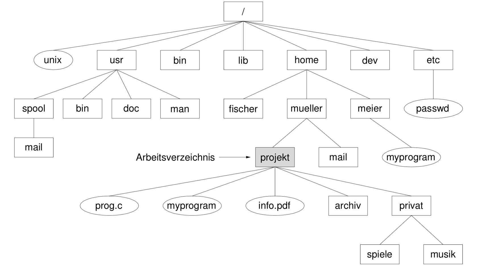

# Kurseinheit 5

## 5.1 Wie kommuniziert die CPU mit Geräten

Die allermeisten Geräte werden über einen Controller mit mit der CPU verbunden. Controller sind entweder auf der Hauptplatine des Rechners oder in Form einer Steckkarte mit CPU und Hauptspeicher zusammen im gleichen Gehäuse untergebracht.

Vorteile:

* CPU wird von elementaren Aufgaben (z. B. Checksums zur Fehlererkennung) entlastet. Controller hat spezialisierten Prozessor hierfür
* neuartige Geräte mit Controller, der bekannten Gerätetyp simuliert, kann ohne Änderung des BS an einem Rechner betrieben werden

### 5.1.2 Wie kann die Kommunikation zwischen CPU und Controllern realisiert werden

CPU und Controller benutzen spezielle Register im Controller für Daten und Befehle, um miteinander zu kommunizieren. Die das Betriebssystem aus- führende CPU übermittelt den Controllern Aufträge und ggf. Parameter, und die Controller geben Abschlussmeldungen, Fehlercodes, gelesene Daten u.ä. zurück. Es gibt zwei Techniken:

* **I/O-Ports**: Jedem Register eines Controllers wird eine Port-Nummer zugewiesen. Die CPU kann durch den Assembler-Befehle diesen Port lesen/schreiben
* **memory-mapped I/O**: Alle Geräte können einheitlich im Adressraum des Hauptspeichers angesprochen werden
    - Vorteil: Man kann mit Hochsprache statt Assembler auf Hardware zugreifen

### 5.2.1 Welche drei Techniken gibt es für die Ein-/Ausgabe? Wie funktioniert die Ein- und Ausgabe? Welche Vor- und Nachteile haben diese Techniken?

#### 1. Programm-gesteuerte Ein-/Ausgabe

Applikationen wollen unabhängig voneinander Ein- oder Ausgaben durchführen: Systemaufruf wird synchron von CPU abgearbeitet (aktives Pollen der Controller-Register). Einfach, aber CPU wird komplett belegt.

#### 2. Interrupt-gesteuerte Ein-/Ausgabe

E/A-Operationen sind asynchron und arbeiten mit Hilfe von Unterbrechungen.

Phasen:

1. Startphase: E/A-Auftragsübermittlung mit Parametern von CPU an Gerät. Hierdurch wird das Gerät gestartet und ein Datentransport zwischen Gerät und Puffern bzw. Registern initiiert.
2. Wartephase: Warten auf Ende des Transports. Das Ende der Wartephase wird durch eine Unterbrechung angezeigt.
3. Nachbearbeitungsphase: aufgetretene Fehler analysiert, Puffer reorganisiert und ähnliches Aufgaben erledigt werden.

Nachteil: Auch hier ist die CPU noch involviert, Daten werden wortweise zwischen Hauptspeicher und Controller hin und her geschaufelt

#### 3. Ein-/Ausgabe mit DMA

Bestimmte Controller dürfen Daten in den Hauptspeicher schreiben. Die CPU wird erst wieder involviert, wenn die gewünschten Daten bereits im Hauptspeicher sind. Der DMA-Controller besitzt mindestens vier Register, die vom Prozessor gelesen und geschrieben werden können, und kann unabhängig von der CPU auf das Bus-System zugreifen.

Beispiel:

1. Um die HDD-Übertragung zu initialisieren, schreibt die CPU die Quelle (Festplatte), das Ziel (die Anfangsadresse eines Hauptspeicherbereichs, in den die Daten geschrieben werden sollen) und die Menge der zu übertragenden Daten in die DMA-Register und gibt zusätzlich ein Lese-Kommando mit der Nummer des zu lesenden Sektors an den Controller der Festplatte ab.
2. Die CPU mit anderen Arbeiten fort.
3. Der Festplatten-Controller liest inzwischen die Daten von der Festplatte in seinen Puffer und führt die Fehlerprüfung durch.
4. Sobald die gültigen Daten im Puffer des Festplatten-Controllers vorliegen, sendet er ein Signal an den DMA-Controller.
5. Der DMA-Controller veranlasst nun den Festplatten-Controller, die Daten aus dem Puffer wortweise über den Systembus in den vorgegebenen Bereich im Hauptspeicher zu schreiben.
6. Danach erzeugt der DMA-Controller eine Unterbrechung und teilt der CPU so mit, dass die Daten jetzt im Hauptspeicher vorliegen.

## 5.3 Wie sieht das Schichtmodell für E/A-Software aus

### 5.3.1 Welche Aufgaben hat jede Schicht

S. 215

## 5.4 Wie verwaltet das Betriebssystem die E/A-Aufträgen und Geräten

### E/A-Aufträge

Mehrere Ein-/Ausgaben können für das gleiche Gerät gelten; z.B. können mehrere Prozesse Sektoren auf derselben Platte lesen oder schreiben. Daher muss für jedes Gerät eine E/A-Auftragsliste vom Betriebssystem geführt werden. Bei Geräten, die mehrere Aufträge parallel behandeln können und bei denen die Aufträge nicht notwendigerweise in der Reihenfolge beendet werden, in der sie angekommen sind (z. B. bei manchen Platten/Controllern), muss bei jeder Fertigmeldung des Geräts zugleich angegeben werden, welcher Auftrag gemeint ist.

### Geräte

Ein Drucker kann einen Papierstau haben oder gerade mit dem Ausdrucken einer Seite beschäftigt sein oder eine Kommunikationsverbindung kann gerade gestört sein. Die Gerätezustandstabelle enthält für jedes angeschlossene Gerät alle derartigen Angaben sowie die E/A-Auftragsliste.

## 5.5 Warum braucht man Pufferung im Hauptspeicher bei der Ein-/Ausgabe

Wenn ein Benutzerprozess einen Datenblock von einer Platte in einen Datenbereich in seinem Adressraum lesen will, führt er einen read-Systemaufruf aus und blockiert dann und wartet, bis die relativ langsame Übertragung abgeschlossen ist. Danach wird der Block verarbeitet und der nächste Block gelesen, nun blockiert der Prozess wieder. Dieser Vorgang ist sehr ineffizient. Außerdem könnte ein Benutzerprozess aus irgendeinem Grund gezwungen sein, seinen Adressraum zeitweilig auszulagern.

Effizienzsteigerung:

* Double Buffering: Während das Betriebssystem einen Puffer leert bzw. füllt, werden Daten an den zweiten Puffer übertragen
* Ringpuffer: Mehr als zwei Puffer werden verwendet

## 5.6 Welche Techniken gibt es, um exklusive Geräte zu reservieren? Wie funktionieren sie

Spooling: Drucker sind langsam und werden von vielen benutzt, müssen aber pro Ausdruck exclusiv belegt werden. Das Betriebssystem simuliert für jeden Prozess einen eigenen privaten Drucker. Druckjobs werden in Datei gesammelt. Ein `daemon` fügt die Datei in eine Warteschlange (Spooling-Verzeichnis) ein und leitet gibt diese nach und nach direkt auf dem Drucker aus.

Allgemein: Versucht ein Prozess, ein Gerät zu belegen, das nicht frei ist, blockiert er und wird in eine Warteschlange gelegt. Wenn das Gerät wieder frei ist, darf der erste Prozess in der Warteschlange es belegen und erhält den Zugriff

## 5.7 Warum muss ein Benutzerprozess das Betriebssystem beauftragen, eine E/A-Operation auszuführen

Für E/A-Operation ist der Kernel-Mode zuständig.

## 5.8 Welche Aufgaben haben der E/A-Teil des Betriebssystems, der Gerätetreiber, der Interrupt-Handler und Controller bei einer z.B. read()-Operation? Wie arbeiten sie zusammen? Wie wird eine E/A-Operation durchgeführt

## 5.9 Welche Ziele hat der E/A-Softwareentwurf

* Verwaltung der Geräte
* Abwicklung der E/A-Systemaufrufe
* Schnittstelle zu den Benutzerprogrammen soll folgende Eigenschaften aufweisen:
    * **Geräteunabhängigkeit von Applikationen**: Definition von virtuellen Gerätetypen mit spezifizierten Schnittstellen (z.B. virtueller Typ *Datenträger*)
    * **Einheitliche Namen**: Applikationen haben keine Bezeichnungen für Geräte (explizit oder implizit). Die Dateien bzw. Geräte werden als Parameter eingebunden
    * **Kodierungsunabhängigkeit**: Applikation in UTF-8, Übersetzungen von und nach gerätespezifischen Codierungen müssen automatisch vorgenommen werden (z.B. im Treiber)
    * **Wechselseitiger Ausschluss**
    * **Fehlerbehandlung**: Sollten möglichst Hardware-nah behandelt werden (z.B. Übertragungsfehler wird direkt im Festplattencontroller fehlerkorrigiert)

## 5.10 Wie ist eine Festplatte aufgebaut

### 5.10.1 Welche Fähigkeit hat eine Festplatte ohne Dateisystem

Das Betriebssystem kann (über den Controller) einzelne Sektoren der Platte lesen oder schreiben. (Der Festplatte ist es egal, ob ein FS installiert ist oder nicht)

## 5.11 Wie wird die Zugriffszeit auf eine Festplatte definiert

* **Suchzeit**: Die Lese-/Schreibköpfe werden auf die gesuchte Spur positioniert. Die Zeit für eine konkrete Positionierung hängt von der zu überwindenden Distanz ab
* **Latenzzeit**: Es wird gewartet, bis sich die Platte soweit weitergedreht hat, dass der gesuchte Sektor bei den Köpfen erscheint. (Abhängig von Rotationsgeschwindigkeit)
* **Übertragungszeit**: Während der Kopf über den Sektor gleitet, werden die gelesenen bzw. geschriebenen Daten vom bzw. zum Controller übertragen

**Zugriffszeit:** *Suchzeit + Latenzzeit + Übertragungszeit*

### 5.11.1 Welche Maßnahmen im Betriebssystem und im Controller können die Suchzeit, die Latenzzeit und die Übertragungszeit verkürzen oder einsparen

* Verwaltung von Warteschlangen der Übertragungsaufträge (SSTF und SCAN)
* Interleaving
* Puffer

## 5.12 Wie funktionieren die Strategien SSTF und SCAN? Welche Vorteile und Nachteile haben die Strategien

### shortest-seek-time-first (SSTF)

Die Suchzeit ist linear zu der überbrückenden Distanz des Lese-/Schreibkopfs. Daher sollten Aufträge in Zylindern, die der aktuellen Position der Köpfe nahe liegen, bevorzugt werden. Als jeweils nächster sollte also derjenige Übertragungsauftrag ausgeführt werden, bei dem die kleinste Suchzeit auftritt

Vorteil: Schnelle mittlere Suchzeit
Nachteil: Starvation möglich

### Fahrstuhlalgorithmus (SCAN)

Die Köpfe wandern immer abwechselnd nach außen und innen, solange in der jeweiligen Richtung Aufträge vorliegen.

Vorteil: Die mittlere Ausführungszeit eines Übertragungsauftrags incl. der Wartezeit bis zum Beginn der Ausführung ist kürzer.
Nachteil: Die mittlere Suchzeit ist bei SCAN  höher

## 5.13 Was ist das Interleaving und der Interleaving-Faktor

Problem: Beim Lesen wird der 1. Block in den Puffer des Controllers übertragen. Von dort muss er über den Bus zum Hauptspeicher übertragen werden. Wenn die hierfür benötigte Zeit deutlich länger als die Zeit ist, in der der Lese-/Schreibkopf die Lücke zwischen zwei Sektoren überquert, dann befindet sich der Kopf schon über oder hinter dem 2. Sektor.

Deswegen überspringt man beim Schreiben jeweils einen oder mehrere Sektoren. Wieviele Sektoren übersprungen werden sollen, hängt vom Rechner ab; diese Anzahl, die man **interleave factor** nennt, muss beim Formatieren der Platte festgelegt werden

## 5.14 Wozu ist ein Dateisystem gut? Was ist ein Dateisystem? Was ist ein hierarchisches Dateisystem

Ein Dateisystem ist eine Menge von Dateien und Verzeichnissen, die incl. der erforderlichen Hilfsdaten auf einem physischen oder logischen Datenträger ge- speichert sind. Ein Dateisystem soll die **Transparenz** schaffen, dass dem Besitzer der Dateien die Details der physikalischen Datenspeicherung verborgen bleiben.

*hierarchisches Dateisystem* = verschachtelte Verzeichnisse

## 5.15 Welche Verfahren gibt es, um die Sektoren einer Datei zu verwalten

Um den Inhalt einer Datei den Sektoren einer Platte zuordnen zu können, wird er in Seiten aufgeteilt. Eine Datei entspricht somit einer Folge von Seiten.

## 5.16 Was ist eine FAT beim MS-DOS Betriebssystem

Eine *file allocation table* (**FAT**) ist eine zentrale Datenstruktur, die Informationen über alle Dateien eines Dateisystems sowie über die freien Blöcke enthält. (MS-DOS und Windows-Betriebssystemen)

### 5.16.1 Wie groß ist eine FAT

Die FAT wird in einem oder mehreren fest vereinbarten Sektoren z. B. am Anfang einer Partition der Platte gespeichert. Bei Starten des Betriebssystems wird sie in einen Puffer im Hauptspeicher übertragen und bleibt dort permanent. Eine FAT hat für jeden Block auf der Festplatte einen Eintrag.

### 5.16.2 Wie werden die Sektoren einer Datei mit einer FAT verwaltet

### 5.16.3 Wie kann ein Block einer Datei in FAT gefunden werden

Sequentielles Verarbeiten in einer linearen Liste.

### 5.16.4 Welche Vor- und Nachteile hat die FAT? Was kann die FAT gut unterstützen

Vorteil: Sequentielles Verarbeiten einer Datei wird durch die FAT sehr gut unterstützt
Nachteil: Die gesamte FAT Tabelle muss sich zu jeder Laufzeit des Rechners im Hauptspeicher befinden.

## 5.17 Was ist eine Sektoradresstabelle

Dezentral für jede Datei wird eine eigene **Sektoradresstabelle** auf dem Sekundärspeicher gehalten, die alle Adressen von Sektoren speichert, die Seiten dieser Datei enthalten. (*File-Control-Block*).

## 5.18 Was ist die Idee bei i-nodes? Was ist ein i-node unter UNIX? Was steht in einem i-node

Zu jeder Datei existiert ein sogenannter i-node (Index-Node); das ist eine Tabelle, die Angaben über die Datei enthält. Im Hauptspeicher werden nur die i-nodes der aktuell geöffneten Da- teien gehalten, dies benötigt sehr wenig Platz

### 5.18.1 Wo steht der Name der Datei unter UNIX

Im Verzeichnis der Datei ist ein Eintrag mit dem Dateinamen und die Nummer des i-nodes dieser Datei

### 5.18.2 Wie groß ist ein i-node bei UNIX

Bei dem Dateisystem ext2 beträgt die Größe eines Inodes standardmäßig 128 Byte

### 5.18.4 Was steht genau in der 10 direkten Sektoradressen

Die Einträge 0 bis 9 der Sektoradresstabelle zeigen auf die Adressen der ersten 10 Seiten der Datei

### 5.18.5 Was zeigt eine indirekte Sektoradresse

Der hier angegebene Indexblock enthält `x` direkte Sektoradressen, entsprechend den Einträgen 10 bis 9 + `x` der Sektoradresstabelle

### 5.18.6 Was sind die doppelt und dreifach indirekten Sektoradressen

In der **doppelt** indirekten Sektoradresse ist ein Indexblock, welcher `x` indirekte Sektoradressen enthält, entsprechend den Einträgen 10 + `x` bis 9 + `x` + `x^2` der Sektoradresstabelle.

In der **dreifach** indirekten Sektoradresse ist ein Indexblock, welcher `x` doppelt indirekte Sektoradressen enthält, entsprechend den Einträgen 10 + `x` + `x^2` bis 9 + `x` + `x^2` + `x^3`  der Sektoradresstabelle.

### 5.18.7 Wie groß kann eine Datei sein, die mit i-node verwaltet wird

Die Sektoradresstabelle einer Datei ist in 4 Abschnitte der Länge 10, x, x2 und x3 aufgeteilt, z. B. bei x = 256 mit den Längen 10, 256, 65.536 und 16.777.216. Sektoradresstabellen mit mehr als 10 + x + x2 + x3 Einträgen, die bei unserem Beispielwerten einer Datei von rund 16 GByte entsprechen, sind nicht möglich.

## 5.18.8 Wie kann man das X berechnen? Wie groß kann das X sein?

1 KByte große Blöcken
4 Byte lange Sektoradressen

x = 1024 Byte / 4 Byte = 256

### 5.18.9 Wie viele Zugriffe auf die Indexblöcke bei i-node werden maximal benötigt

Selbst bei extrem großen Dateien kommt man über maximal **drei** Indexblöcke zu einer beliebigen Seite, dies gilt auch für die letzte Seite und für das Anhängen von Dateiinhalt

### 5.18.10 Wie kann eine Datei unter UNIX mit Hilfe der i-nodes gefunden werden

Beobachten wir nun einmal, wie das Dateisystem z.B. die Datei `/home/meier/myprogram` in der bekannten Abbildung findet

Der i-node des Wurzelverzeichnisses ist immer im Hauptspeicher. Im Wurzelverzeichnis findet das System den Dateinamen `home` und dessen i-node-Nummer. Dieser i-node muss aus dem i-node-Bereich gelesen werden und dann der Inhalt des Verzeichnisses `home`. Hierin wiederum wird der Eintrag `meier` gesucht, dessen i-node gelesen und dann der Inhalt dieses Verzeichnisses. Schließlich wird darin der Eintrag `myprogram` gesucht, und über dessen i-node kann nun endlich auf den Dateiinhalt zugegriffen werden.

## 5.19 Wie sieht ein klassisches UNIX-Dateisystem aus

## 5.20 Wie funktioniert das Sektorfolgen-Verfahren zur Verwaltung der Sektoren einer Datei

Beim Sektorfolgen will man gegenüber Sektoradresstabellen zwei Verbesserungen gleichzeitig erreichen: Der Platzbedarf für Indexblöcke wird reduziert und Plattenarmbewegungen werden vermieden. Dieses soll erreicht werden, indem die zu einer Datei gehörenden Blöcke möglichst hintereinander auf einer Spur bzw. einem Zylinder der Festplatte angeordnet sind (vgl. Interleaving). Bei großen Platten, die nicht allzu voll sind, können erfahrungsgemäß fast alle kleinen bis mittelgroßen Dateien in 1 oder 2 Sektorfolgen untergebracht werden, die Länge der Sektorfolgen liegt typischerweise im Bereich von 5 bis 20.

### 5.20.1 Wie funktioniert das NTFS-Dateisystem

Die wichtigste Datenstruktur des NTFS ist die sogenannte **MFT (master file table)**, die aus einem Array von Einträgen der festen Größe 1 KByte besteht. Standardmäßig werden 12,5 Prozent der Partition dafür reserviert, theoretisch sind maximal 248 Einträge in der MFT möglich. Jeder Eintrag entspricht dem Inhalt eines *i-node* bei UNIX (Attribute: Name, Besitzer, Zeitstempel, die Zugriffsrechte und eine Liste aller zugehörigen Adressen von Datenblöcken auf der Festplatte). Bei einer sehr kleinen Datei können sogar die Daten schon innerhalb des Eintrags untergebracht werden. 

Es kann eine extrem große Datei mehrere Einträge in der MFT benötigen, in diesem Fall enthält der erste Eintrag (*Base Record*) die Nummern der anderen Einträge in der MFT. Jede Datei auf einer Partition wird durch eine 64 Bit-Zahl eindeutig identifiziert, wobei die ersten 48 Bit genau dem Index des *Base Record* der Datei in der MFT entsprechen und die letzten 16 Bit die *Sequenznummer* darstellen

### 5.20.2 Was bedeutet ein Jounaling-Dateisystem

Ein Protokoll (**Journal**) wird mitgeführt, in welchem aufgeschrieben wird, welche Operationen (Änderungen) ausgeführt werden. Das Wichtigste ist, dass die Operationen zuerst in das Log geschrieben werden und anschließend der Eintrag im Log auf einen Bereich auf der Festplatte übertragen wird, bevor die Operationen ausgeführt werden. Das Schreiben des Logs vom Hauptspeicher auf die Festplatte muss natürlich **atomar** sein.

Der Eintrag im Journal kann erst gelöscht werden, wenn die Operation fertig ausgeführt wurde.

## 5.21 Welche Verfahren gibt es, um die freien Sektoren zu verwalten? Wie funktionieren sie und welche Vor- und Nachteile haben sie

* freie Sektoren als verkettete Liste
    * freie Liste als eine Datei (FAT)
    * Folgesektorinformation liegt selbst im Sektor
    * Speicherung der freien Sektornummern in Indexblöcken
* Bitmap von freien Sektoren (ein Bit pro Sektor)

## 5.22 Wie werden bei UNIX die Zugriffsrechte einer Datei realisiert

(Siehe Schutzbits in Kurseinheit 6)