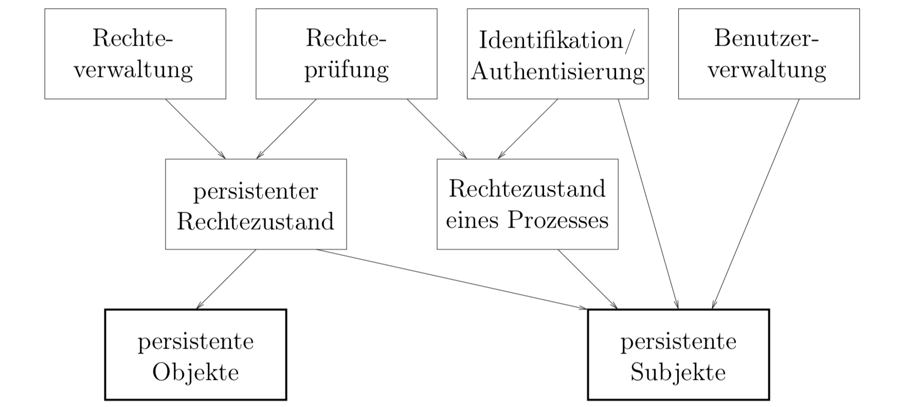

# Kurseinheit 6

## 6.1 Was sind die Ziele der Sicherheitsmaflnahmen

* **Vertraulichkeit**: Daten dürfen nur von Personen gelesen werden, die hierzu befugt sind
* **Integrität**: Unversehrtheit und Korrektheit von Daten
* **Verfügbarkeit:** Alle Programme und das BS müssen stets verfügbar sein => Gefahr z.B. durch denial-of-service-Angriff
* **Schutz vor finanziellem Verlust**: Rechner wird von Personen benutzt, die hierfür nicht zugelassen sind und die Kosten nicht tragen
* **Schutz vor Missbrauch**:  kriminellen Handlungen (Botnet / Spam etc.)

## 6.2 Was sind der Unterschied zwischen dem persistenten und transienten Rechtezustand

* **persistent**: der Systemabschaltungen überdauernde Zustand eines Rechners. Der persistente Rechtezustand macht direkt oder indirekt Aussagen darüber, welche Subjekte auf welchen Objekten welche Operationen ggf. mit welchen Parametern ausführen dürfen oder nicht ausführen dürfen. Man erkennt sofort, dass nur solche Subjekte und Objekte im Rahmen des persistenten Rechtezustands Sinn machen, die ebenfalls persistent sind; Prozesse sind z. B. keine persistenten Subjekte. In vielen Systemen sind nur Dateien persistente Objekte (Linux: alles ist eine Datei)

* **transient**: Nachdem im Rahmen der Rechteprüfung einem Prozess ein bestimmter Zugriff erlaubt wurde, ist es sehr häufig praktisch, dies als Entstehung eines neuen transienten Rechts aufzufassen, bei dem der Prozess Subjekt ist. Ein Prozess ist in diesem Sinne ein transientes Subjekt, das bei Beendigung des Prozesses oder bei einem Systemstillstand automatisch verschwindet.

### 6.2.1 Kann man Beispiele angeben

Beim Öffnen einer Datei werden die Rechte der aktiven Subjekte auf Basis des persistenten Rechtezustands überprüft. Wenn ausreichende Rechte vorhanden sind, wird die Datei im gewünschten Modus geöffnet; hierbei wird intern ein Dateikontrollblock angelegt, in dem u. a. die erlaubten Zugriffsmodi vermerkt sind.

Nachdem die Datei einmal geöffnet ist, werden bei jedem einzelnen Lesen eines Zeichens oder Satzes die Rechte nur noch auf Basis der Daten im Dateikontrollblock geprüft, nicht mehr auf Basis des persistenten Rechtezustands

## 6.3 Was versteht man unter Subjekten und Objekten

**Objekte** sind alle, auf das mittels Zugriffskontrolle zugegriffen werden kann:

* normale und ausführbare Dateien
* Verzeichnisse bzw. ganze Bäume von Verzeichnissen
* Bänder, Disketten oder andere Medien,
* Schnittstellen, Uhren, Seiten, Datenstrukten

Jedes Objekt hat einen eindeutigen Namen, über den es referenziert wird und eine endliche Menge von Operationen, die von Prozessen auf diesem Objekt ausgeführt werden können. Z. B. für eine Datei sind die Operationen **read** und **write** sinnvoll; bei einem Semaphor sind **down** und **up** sinnvoll.

**Subjekte** sind Einheiten, die auf Objekte zugreifen können. Sie können Benutzer, Prozesse, Schnittstellen usw. sein.

## 6.4 Was ist der Unterschied zwischen Identifikation und Authentisierung

* **Identifikation**: Dem Benutzer wird nach dessen Identifizierung eine initiale Arbeitsumgebung zur Verfügung gestellt
* **Authentisierung**: Die Kenntnis eines Benutzernamens ist i. A. kein hinreichender Beweis dafür, dass die von einem Benutzer angegebene Identität mit seiner tatsächlichen übereinstimmt. Im Rahmen der login-Prozedur kann daher die Vorlage zusätzlicher Beweise (z.B. Passwort) für die Echtheit der angegebenen Benutzeridentität verlangt werden.

## 6.5 Was ist das SETUID-Bit

Setuid (Set User ID, manchmal auch suid) ist ein Zugriffsbit für Dateien oder Verzeichnisse des Unix-Betriebssystems.

* Ausführbare Programme bei denen dieses Bit gesetzt ist, werden mit den Rechten des Benutzers ausgeführt dem die Datei gehört, anstatt mit den Rechten desjenigen Benutzers, der die Datei ausführt.
* Auf Verzeichnissen bewirkt Setuid, dass Dateien, die innerhalb des Verzeichnisses angelegt werden, nicht dem Benutzer gehören, der sie anlegt, sondern dem Eigentümer des Verzeichnisses.

## 6.6 Können Sie ein Beispiel der Anwendung von SETUID-Bit angeben Wie funktioniert die Änderung der passwd-Datei? Was ist mit der Sicherheit bei Benutzung vom SETUID-Bit

(Die Änderung der passwd-Datei. Wie viele passwd-Dateien gibt es? Wie sehen die Zugriffsrechte auf sie aus? Bei welcher Datei wird das SETUID-Bit gesetzt?)

Die Datei, in der unter UNIX die Passwörter aller Benutzer gespeichert sind, kann nur von root beschrieben werden. Dennoch sollte jeder Benutzer die Möglichkeit haben, sein eigenes Passwort zu ändern. Dazu gibt es das Programm usr/bin/passwd, bei welchem das s-bit gesetzt ist. Der Prozess erhält beim Aufruf die Rechte des Besitzers, also root, und kann die Passwortdatei ändern. Das Programm wird aber nur die Änderung des eigenen Passwortes erlauben.

## 6.7 Wie funktioniert die Spooling-Technik

Ein Spooling ist eine Warteschlange oder ein Puffer, um die Dateien aufzunehmen, die z.B. ausgedruckt werden sollen. Diese Warteschlange muss geschützt werden, es kann nicht sein, dass jeder Benutzer-Prozess einfach seine Datei in die Warteschlange schreiben darf.
Also braucht man ein Druckerprogramm, bei der Ausführung des Programms wird ein spezieller Prozess erzeugt, der das Schreiben in die Warteschlange übernimmt. Dieser Prozess gehört einem speziellen Benutzer `daemon`, nur er darf das Programm schreiben und lesen, die anderen können das Programm nur ausführen(mit Schutzbits: `rwxs--x--x)`. Wenn das s-bit des Programm gesetzt wird, kann auch jeder Benutzer mit den Rechten des Besitzers das Druckerprogramms ausführen. Das Schreiben in die Warteschlange wird durch das Programm kontrolliert.

## 6.8 Was ist eine Zugriffskontrollliste

Ganz allgemein ermöglichen Zugriffskontrollen, einzelnen Subjekten den Zugriff auf einzelne Objekte zu erlauben oder zu verbieten.

Die Zugriffskontrollliste (access control list, ACL) gehört dabei zu den granulatorientieren(objektorientierten) Implementierungen, da die Rechtefestlegungen **beim Objekt** gespeichert werden (im Gegensatz zur subjektorientierten Implementierung).

Eine ACL ist ein Record, wobei jeder Eintrag für jeden zu einer Domäne gehörenden Prozess angibt, für welche Modi der Zugriff erlaubt ist, siehe Abb. 6.3., Skript S. 228.
Es gibt ferner die "benannten ACLs": Man kann ACLs als eigenständige Einheit auffassen, ihnen einen Namen geben und mehreren Objekten die gleiche benannte ACL zuweisen.

## 6.8.1 Was ist der Vorteil

(Ein Benutzer kann die Zugriffsrechte selbst vergeben)

* bei ACL **allgemein**: Default-Wert ist "verboten", d.h. alles erlaubte muss explizit erlaubt sein
* bei **benannten ACLs**: Wenn mehrere Objekte die gleiche ACL haben, spart man Platz
* Der Besitzer einer Datei kann bei ACLs selbst festlegen kann, wer und welche Zugriffsrechte auf eine Datei hat.

## 6.9 Wie sehen die Schutzbits bei UNIX aus

Bei Schutzbits werden zu jeder Datei drei Gruppen zu je drei Bits angegeben. Zu jeder Gruppe

1. Datei-Eigentümer
2. Gruppe (Eigentümer muss nicht unbedingt Mitglied in der Gruppe sein)
3. Sonstige

legt jeweils ein Bit fest, ob Leserecht, Schreibrecht oder Ausführungsrecht erteilt ist.

Bsp. `rwxrw-r--`

### 6.9.1 Wie werden die Rechte einer Datei für einen Benutzer ausgewertet

Die Schutzbits werden immer der Reihe nach geprüft. Wenn ich Mitglied in einer Gruppe bin und diese Gruppe keinen Zugriff hat, wird mir der Zugriff verweigert, auch wenn alle übrigen Zugriff bekommen.

### 6.9.2 Wie kann man mit Schutzbits realisieren, dass eine Datei allen bis auf eine Gruppe von bestimmten Personen zugänglich ist

Rechtevergabe: `rwx---rwx`

## 6.11 Was ist eine Capability

Capabilities gehören zu den subjektorientierten Implementierungen, die Rechte sind folglich beim Subjekt gespeichert. Nun kann man leicht herausfinden, welche Rechte ein Subjekt hat, es ist jedoch schwerer herauszufinden, welche Rechte für ein Objekt vorhanden sind.

Capability ist äquivalent zu einem Profil -> Unterschied liegt in der Adressierung der Objekte.

Eine Capability besteht aus einem Objektverweis plus die Operationen auf dem Objekt. Dieser Verweis muss geschützt werden, z.B. das Betriebssystem bewahrt die Capabilities auf.

### 6.11.1 Kann man ein Beispiel geben, wie es funktioniert

Wenn ein Prozess eine Datei mit open() öffnen will, sucht das Dateisystem zuerst die Lokalisierung der Datei auf der Festplatte. Danach erzeugt das Betriebssystem einen Dateikontrollblock (ein Dateikontrollblock heißt bei UNIX auch i-node) für die Datei, in dem der Besitzer der Datei, Gruppe, Opreationen auf der Datei (read, write, append), i-node usw. stehen. Das Dateikontrollblock wird in eine Tabelle von allen offenen Dateien (system-wide open-file table) eingetragen, die zur Verwaltung der offenen Dateien vom Betriebssystem gebraucht wird. Die Stelle des Dateikontrollblocks in der Tabelle ist eine ganze Zahl, also eine Nummer. Diese Nummer wird wieder in die Tabelle der offenen Dateien des Prozesses (per-process open-file table) eingetragen. Die Tabelle per-process open-file table heißt in Kurseinheit 7 Umsetztabelle des Prozesses, der Nummer des Dateikontrollblocks heißt Dateiidentifizierer, siehe
Abbildung 7.3 im Kurseinheit 7.
Jetzt werden die Rechte des Prozesses (Subjektes) auf die Datei im Betriebssystem aufbewahrt. Der Prozess hat auch nur die Rechte auf die Datei, die bei der Erzeugung des Dateikontrollblocks übergeben wurden. Wenn der Prozess die Datei lesen oder schreiben möchte, muss er den Dateiidentifizierer als Index zum system-wide open-file table als Parameter übergeben. Dieser Dateiidentifizierer ist der Objektverweis oder das Ticket.

## 6.12 Was ist die Schwäche diskretionärer Zugriffskontrollen

Nur der Zugriff zu Datenbehältern wird kontrolliert, nicht hingegen zu der darin enthaltenen Information.

Ein Benutzer, welcher das Recht hat, eine Datei zu lesen, kann den Inhalt in einer neuen Datei speichern und diese z.B. der **Welt** zugänglich machen. Subjekte können ihre Rechte also missbrauchen.

## 6.13 Was ist die Idee der Informationsflusskontrollen

**mandatory access controls**: Diese Modelle wurden in erster Linie aufgrund von Anforderungen im Bereich militärischer oder geheimdienstlicher Anwendungen entwickelt. *Nur* für diese Modelle lässt sich mit Hilfe mathematischer Theorien beweisen, dass sie die zunächst informell definierten Sicherheitssziele Vertraulichkeit und Integrität von Information realisieren

Die zentrale Idee ist, Zugriffsbeschränkungen der von einem Prozess gelesenen Daten auf die erzeugten Daten zu **vererben**.

Wenn ein Prozess eine Datei *D1* zum Lesen geöffnet hat und später eine Datei *D2* zum Schreiben, **dann gilt bereits alle Information als von D1 nach D2 übertragen, selbst wenn der Prozess überhaupt keine Daten direkt oder in verarbeiteter Form von D1 nach D2 kopiert hat**.

### 6.13.1 Wie kann man mit dem Bell-La Padula-Modell das Sicherheitsziel der Vertraulichkeit realisieren

Jedem Objekt und jedem Subjekt im Computersystem wird eine Vertraulichkeitsklasse *in Form einer ganzen Zahl* durch das System zugeordnet. Je größer die Vertraulichkeitsklasse desto geheimer ist ein Objekt bzw. desto vertrauenswürdiger ist ein Subjekt. Also ist jedes Subjekt berechtigt, Daten seiner eigenen und kleinerer Vertraulichkeitsklassen zu lesen, höhere aber nicht.

Zugriffsregeln:

* **einfache Geheimhaltungsbedingung**: Ein Prozess darf nur Objekte lesen, die keiner höheren Klasse angehören als der Prozess selbst.
* **Die \*-Eigenschaft**: Ein Prozess darf nur in Objekte schreiben, die keiner niedrigeren Klasse angehören als der Prozess.

Ohne die \*-Eigenschaft könnte ein Prozess den Inhalt eines geheimen Objekts in ein offeneres Objekt kopieren und so die geheimen Daten unberechtigten (niedriger klssifizierten) Subjekten zugänglich machen

**Ruhe-Prinzip**: Ein Prozess kann die Klasse eines Objekts nicht verändern.

**Kommunikationsregel**: Sofern Prozesse miteinander kommunizieren können, darf ein Prozess *P1* nur dann einem Prozess *P2* Daten senden, wenn die Vertraulichkeitsklasse von P1 nicht höher als die von P2 ist

### 6.13.2 Wie kann man mit dem Biba-Modell die Integrität erreichen

Hier wird jedem Objekt und jedem Subjekt – zusätzlich zu der Vertraulichkeitsklasse nach Bell-La Padula – auch noch eine Integritätsklasse zugeordnet, und die Zugriffsregeln für Integrität sind in gewisser Weise dual zu den Regeln für Vertraulichkeit

* **einfache Integritätsbedingung**: Ein Prozess darf nur Objekte lesen, die keiner niedrigeren Klasse angehören als der Prozess selbst.
* **Die \*-Eigenschaft der Integrität**: Ein Prozess darf nur in Objekte schreiben, die keiner höheren Klasse angehören als der Prozess.

Mit diesen Eigenschaften kann also, um im militärischen Beispiel zu bleiben, ein Leutnant den Befehl eines Generals nicht verändern. Die Integritätsklasse einer Datei garantiert, dass deren Inhalt nur aus Quellen gleicher oder höherer Integrität stammt.